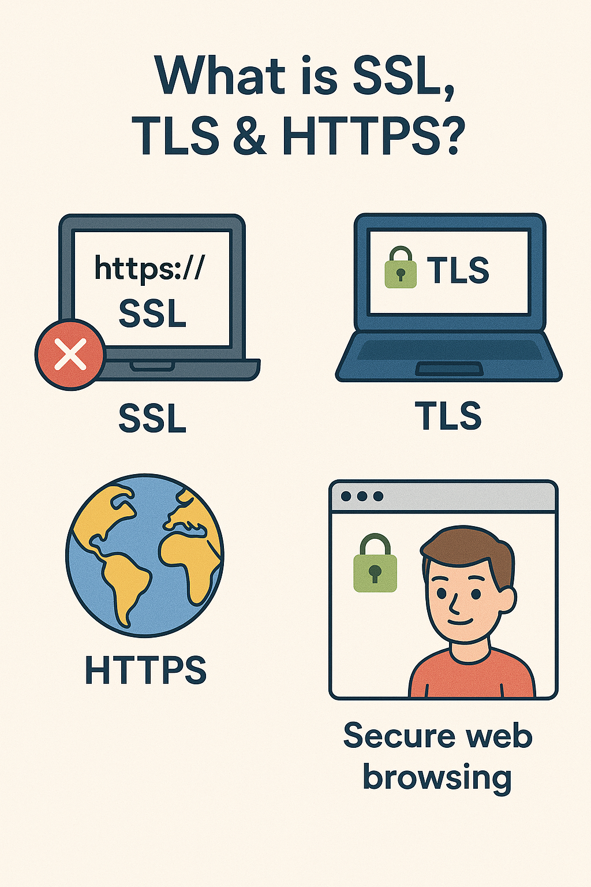

# Part 1 - What Is SSL, TLS & HTTPS?

## 🔐 What is SSL?

**SSL** stands for **Secure Sockets Layer**. It was the first widely-used way to secure connections on the internet, like encrypting traffic between your browser and a website.

🔒 But SSL is **old and no longer safe** — it’s like an outdated lock.

---

## 🔐 What is TLS?

**TLS** stands for **Transport Layer Security** — it replaced SSL.

It does the same job: protects your data when it travels across the internet. But TLS is:
- Faster
- Safer
- Still used today

✅ **When people say “SSL” today, they often mean “TLS”.**

---

## 🌐 What is HTTPS?

**HTTPS = HTTP + TLS**

- **HTTP** is how your browser talks to websites (without security)
- **TLS** adds **encryption** and **identity checking**

So:
- `http://` is open and insecure ❌
- `https://` is safe and encrypted ✅

When you visit a secure site:
1. Your browser checks the website’s certificate
2. It uses TLS to make a secure connection
3. You see a 🔒 lock icon in the address bar

---

## 🧠 Why This Matters

- Stops hackers from spying
- Proves you’re talking to the real website
- Keeps your data safe

