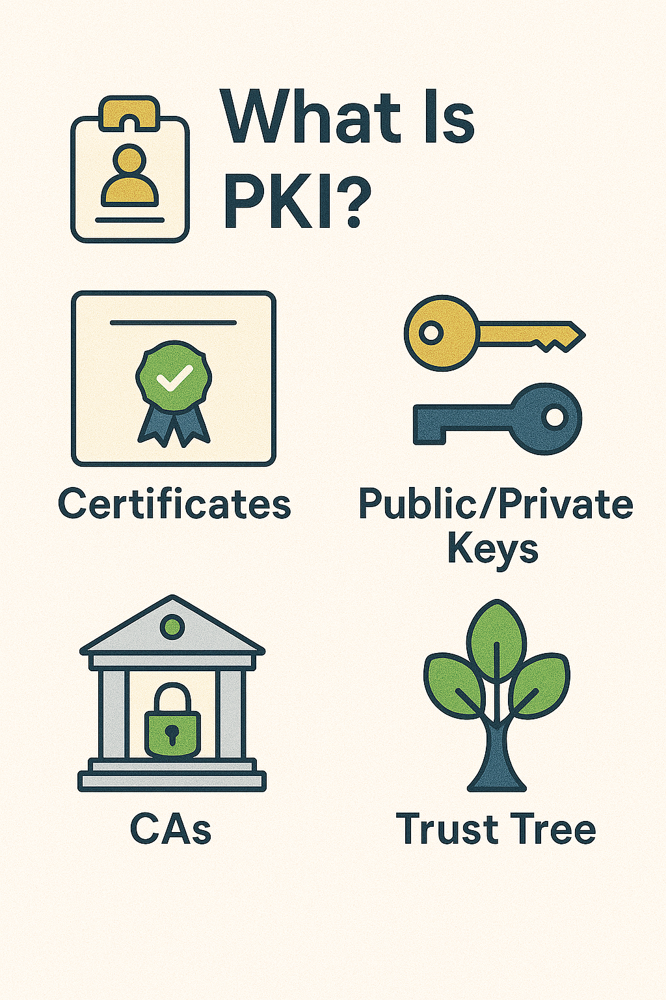

# Part 2 - What Is PKI (Public Key Infrastructure)

## 🔐 What is PKI?

**PKI** is like the internet’s ID and trust system.

It’s made of:
- 🧑‍⚖️ Certificate Authorities (CAs)
- 🧾 Digital Certificates
- 🔐 Public and Private Keys

---

## 📘 Real Life Analogy

- You get a **passport** from your government → like a certificate from a CA
- Anyone can check it and know **you are who you say you are**

---

## 🔗 PKI System Includes:

1. **Public key**: You give this to everyone
2. **Private key**: You keep this secret
3. **Certificate**: Links your public key to your identity (like your name or website)
4. **CA**: A trusted authority who signs your certificate

---

## 🏛 Why CAs Matter

If a certificate is **signed by a trusted CA**, your browser or app will trust it.

If it’s signed by someone it doesn’t trust, you’ll see a ⚠️ warning.

---

## 🔁 How PKI Keeps the Internet Safe

- Anyone can encrypt a message to you using your **public key**
- Only you can unlock it with your **private key**
- The certificate helps people know your public key is really yours

