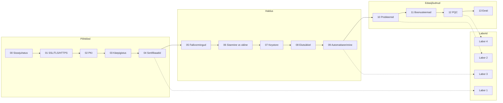
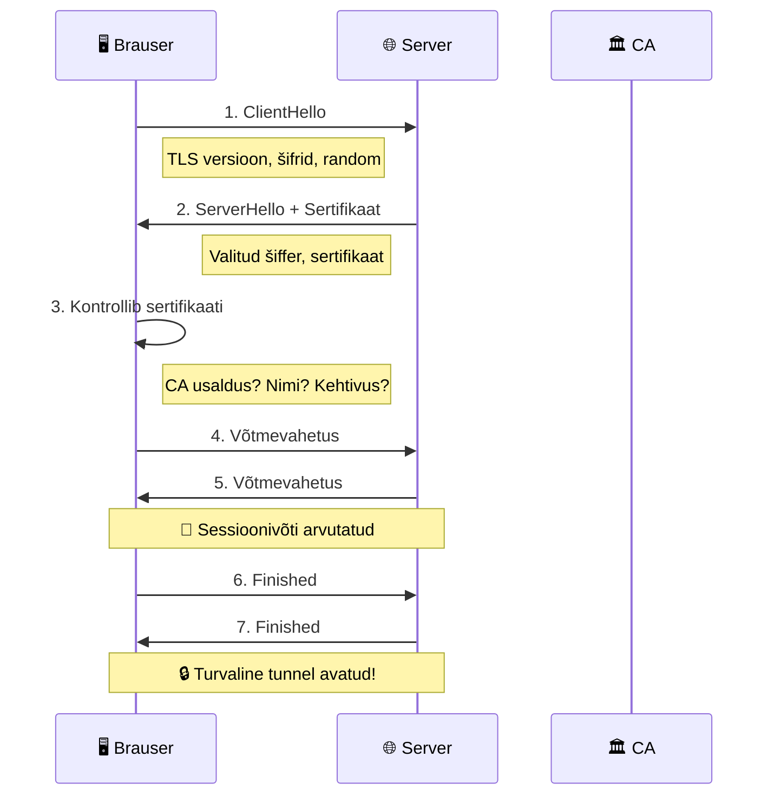

# 🔐 Usalda tabalukku

**Algajasõbralik kursus, mis õpetab, kuidas veeb turvalisena püsib — sertifikaadid, HTTPS ja krüpteerimine.**

---

## 📚 Sisukord

<details>
<summary><strong>Teooria (Osad 0-13)</strong></summary>

| # | Teema | Kirjeldus |
|---|-------|-----------|
| [00](00_Sissejuhatus.md) | Sissejuhatus | Miks see kõik oluline on |
| [01](01_SSL_TLS_HTTPS.md) | SSL, TLS, HTTPS | Protokollide ajalugu ja põhimõtted |
| [02](02_PKI.md) | PKI | Avaliku võtme infrastruktuur |
| [03](03_TLS_kaepigistus.md) | TLS käepigistus | Kuidas turvaline ühendus luuakse |
| [04](04_Sertifikaadid.md) | Sertifikaadid | Digitaalsed passid veebile |
| [05](05_Failivormingud.md) | Failivormingud | PEM, DER, P12, JKS |
| [06](06_Sisemised_valised_sertifikaadid.md) | Sisemised vs välised | Millal millist CA-d kasutada |
| [07](07_Keystore_truststore.md) | Keystore & Truststore | Java sertifikaadihaldus |
| [08](08_Elutsykkel_rotatsioon.md) | Elutsükkel | Sertifikaatide uuendamine ja rotatsioon |
| [09](09_Automatiseerimine.md) | Automatiseerimine | Certbot, Vault, cert-manager |
| [10](10_Probleemide_lahendamine.md) | Probleemid | TLS vigade diagnostika |
| [11](11_Boonusteemad.md) | Boonusteemad | mTLS, HSTS, CT, pinning |
| [12](12_Kvantarvutid_PQC.md) | Post-Quantum | Kvantarvutid ja PQC |
| [13](13_Eesti_PKI.md) | Eesti PKI | ID-kaart, Mobiil-ID, SK, TARA |

</details>

<details>
<summary><strong>Praktilised laborid</strong></summary>

| Labor | Teema | Mida õpid |
|-------|-------|-----------|
| [Labor 1](labor_01_veebiturve.md) | Sertifikaatide loomine | OpenSSL, oma CA, HTTPS server |
| [Labor 2](labor_02_detektiiv.md) | Sertifikaadi analüüs | Uurimine, monitooring, skriptimine |
| [Labor 3](labor_03_vault.md) | HashiCorp Vault | Automatiseeritud PKI Dockeriga |
| [Labor 4](labor_04_pqc.md) | Post-Quantum | OQS, ML-KEM, ML-DSA praktikas |

</details>

---

## 🗺️ Kursuse ülevaade



---

## 🔍 Mõistete indeks

<details>
<summary><strong>A-K</strong></summary>

| Mõiste | Selgitus | Osa |
|--------|----------|-----|
| **ACME** | Automaatne sertifikaadihalduse protokoll | [09](09_Automatiseerimine.md) |
| **AES** | Sümmeetriline krüpteerimisalgoritm | [12](12_Kvantarvutid_PQC.md) |
| **CA** | Certificate Authority, sertifitseerimisasutus | [02](02_PKI.md) |
| **Certbot** | Let's Encrypt ACME klient | [09](09_Automatiseerimine.md) |
| **CRL** | Certificate Revocation List | [06](06_Sisemised_valised_sertifikaadid.md) |
| **CSR** | Certificate Signing Request | [04](04_Sertifikaadid.md) |
| **DER** | Binaarne sertifikaadiformaat | [05](05_Failivormingud.md) |
| **DV** | Domain Validation sertifikaat | [04](04_Sertifikaadid.md) |
| **ECDHE** | Elliptic Curve Diffie-Hellman | [03](03_TLS_kaepigistus.md) |
| **EV** | Extended Validation sertifikaat | [04](04_Sertifikaadid.md) |
| **HSTS** | HTTP Strict Transport Security | [11](11_Boonusteemad.md) |
| **HTTPS** | HTTP + TLS, turvaline veebiühendus | [01](01_SSL_TLS_HTTPS.md) |
| **ID-kaart** | Eesti elektrooniline isikutunnistus | [13](13_Eesti_PKI.md) |
| **JKS** | Java KeyStore formaat | [07](07_Keystore_truststore.md) |
| **Keystore** | Sinu võtmete ja sertifikaatide hoidla | [07](07_Keystore_truststore.md) |

</details>

<details>
<summary><strong>L-P</strong></summary>

| Mõiste | Selgitus | Osa |
|--------|----------|-----|
| **Let's Encrypt** | Tasuta avalik CA | [09](09_Automatiseerimine.md) |
| **ML-DSA** | Post-quantum allkirjaalgoritm (Dilithium) | [12](12_Kvantarvutid_PQC.md) |
| **ML-KEM** | Post-quantum võtmevahetus (Kyber) | [12](12_Kvantarvutid_PQC.md) |
| **Mobiil-ID** | SIM-põhine Eesti digitaalne identiteet | [13](13_Eesti_PKI.md) |
| **mTLS** | Mutual TLS, vastastikune autentimine | [11](11_Boonusteemad.md) |
| **OCSP** | Online Certificate Status Protocol | [06](06_Sisemised_valised_sertifikaadid.md) |
| **OpenSSL** | Krüptograafia tööriistakomplekt | [Labor 1](labor_01_veebiturve.md) |
| **OV** | Organization Validation sertifikaat | [04](04_Sertifikaadid.md) |
| **PEM** | Tekstipõhine sertifikaadiformaat | [05](05_Failivormingud.md) |
| **PKCS#12** | Sertifikaat + võti ühes failis (.p12) | [05](05_Failivormingud.md) |
| **PKI** | Public Key Infrastructure | [02](02_PKI.md) |
| **PQC** | Post-Quantum Cryptography | [12](12_Kvantarvutid_PQC.md) |
| **Privaatvõti** | Salajane võti, mida ei jagata | [02](02_PKI.md) |

</details>

<details>
<summary><strong>Q-Z</strong></summary>

| Mõiste | Selgitus | Osa |
|--------|----------|-----|
| **Q-päev** | Päev, mil kvantarvutid murravad RSA | [12](12_Kvantarvutid_PQC.md) |
| **RSA** | Avaliku võtme krüpteerimisalgoritm | [02](02_PKI.md) |
| **SAN** | Subject Alternative Name | [04](04_Sertifikaadid.md) |
| **SK** | SK ID Solutions, Eesti CA | [13](13_Eesti_PKI.md) |
| **Smart-ID** | Telefoni põhinev Eesti identiteet | [13](13_Eesti_PKI.md) |
| **SSL** | Secure Sockets Layer (vananenud) | [01](01_SSL_TLS_HTTPS.md) |
| **TARA** | Riigi Autentimisteenus | [13](13_Eesti_PKI.md) |
| **TLS** | Transport Layer Security | [01](01_SSL_TLS_HTTPS.md) |
| **Truststore** | Usaldatud CA-de hoidla | [07](07_Keystore_truststore.md) |
| **Vault** | HashiCorp salahalduse tööriist | [09](09_Automatiseerimine.md), [Labor 3](labor_03_vault.md) |
| **Wildcard** | *.domeen.ee sertifikaat | [11](11_Boonusteemad.md) |
| **X.509** | Sertifikaadi standard | [04](04_Sertifikaadid.md) |

</details>

---

## 🎯 Kiirstart

<details>
<summary><strong>🆕 Täiesti algaja?</strong></summary>

Alusta siit:
1. **[Sissejuhatus](00_Sissejuhatus.md)** — miks see oluline on
2. **[SSL/TLS/HTTPS](01_SSL_TLS_HTTPS.md)** — põhimõisted
3. **[PKI](02_PKI.md)** — kuidas usaldus töötab
4. **[Labor 1](labor_01_veebiturve.md)** — tee oma esimene sertifikaat

</details>

<details>
<summary><strong>👨‍💻 DevOps / sysadmin?</strong></summary>

Hüppa otse praktika juurde:
1. **[Automatiseerimine](09_Automatiseerimine.md)** — Certbot, Vault, cert-manager
2. **[Probleemide lahendamine](10_Probleemide_lahendamine.md)** — debugging
3. **[Labor 3](labor_03_vault.md)** — Vault PKI üles seadmine

</details>

<details>
<summary><strong>🇪🇪 Eesti spetsiifika?</strong></summary>

1. **[Eesti PKI](13_Eesti_PKI.md)** — ID-kaart, Mobiil-ID, SK, TARA
2. Kuidas integreerida oma rakendusse

</details>

<details>
<summary><strong>🔮 Tulevikukindlus / PQC?</strong></summary>

1. **[Kvantarvutid ja PQC](12_Kvantarvutid_PQC.md)** — oht ja lahendused
2. **[Labor 4](labor_04_pqc.md)** — PQC praktikas

</details>

---

## 📊 TLS käepigistus ühe pilguga



---

## ⚡ Kiired käsud

<details>
<summary><strong>Sertifikaadi kontrollimine</strong></summary>

```bash
# Vaata sertifikaadi sisu
openssl x509 -in cert.crt -text -noout

# Kontrolli aegumist
openssl x509 -in cert.crt -noout -dates

# Kontrolli serverit
openssl s_client -connect google.com:443 -servername google.com

# Kas võti ja sert klapivad?
openssl x509 -noout -modulus -in cert.crt | md5sum
openssl rsa -noout -modulus -in key.key | md5sum
```

</details>

<details>
<summary><strong>Sertifikaadi loomine</strong></summary>

```bash
# Genereeri võti
openssl genrsa -out server.key 2048

# Loo CSR
openssl req -new -key server.key -out server.csr

# Ise-allkirjasta (testimiseks)
openssl x509 -req -days 365 -in server.csr -signkey server.key -out server.crt
```

</details>

<details>
<summary><strong>Formaatide teisendamine</strong></summary>

```bash
# PEM -> DER
openssl x509 -in cert.pem -outform DER -out cert.der

# PEM -> P12
openssl pkcs12 -export -out cert.p12 -inkey key.key -in cert.crt

# P12 -> PEM
openssl pkcs12 -in cert.p12 -out cert.pem -nodes
```

</details>

---

## 🔗 Kasulikud lingid

<details>
<summary><strong>Eesti</strong></summary>

- [SK ID Solutions](https://www.sk.ee) — Eesti CA
- [id.ee](https://www.id.ee) — ID-kaardi tarkvara
- [TARA dokumentatsioon](https://e-gov.github.io/TARA-Doku/)
- [RIA](https://www.ria.ee) — Riigi Infosüsteemi Amet

</details>

<details>
<summary><strong>Tööriistad</strong></summary>

- [SSL Labs](https://www.ssllabs.com/ssltest/) — Sertifikaadi testimine
- [crt.sh](https://crt.sh) — Certificate Transparency otsing
- [Let's Encrypt](https://letsencrypt.org) — Tasuta sertifikaadid
- [HashiCorp Vault](https://www.vaultproject.io) — PKI automatiseerimine

</details>

---

## 📁 Failide struktuur

```
trust-the-padlock/
├── README.md                          # ← Sina oled siin
├── 00_Sissejuhatus.md
├── 01_SSL_TLS_HTTPS.md
├── 02_PKI.md
├── 03_TLS_kaepigistus.md
├── 04_Sertifikaadid.md
├── 05_Failivormingud.md
├── 06_Sisemised_valised_sertifikaadid.md
├── 07_Keystore_truststore.md
├── 08_Elutsykkel_rotatsioon.md
├── 09_Automatiseerimine.md
├── 10_Probleemide_lahendamine.md
├── 11_Boonusteemad.md
├── 12_Kvantarvutid_PQC.md
├── 13_Eesti_PKI.md
├── labor_01_veebiturve.md
├── labor_02_detektiiv.md
├── labor_03_vault.md
├── labor_04_pqc.md
├── cheat_sheet.pdf
└── images/
    ├── PKI.png
    ├── handshake.png
    └── ...
```

---

## 📜 Litsents

[CC BY 4.0](https://creativecommons.org/licenses/by/4.0/) — võid jagada ja kohandada, kui viitad autorile.

---

<div align="center">

**Loodud järgmise põlvkonna interneti kaitsjatele** 🛡️

</div>
