# Laborid

Praktilised harjutused, kus saad ise käed külge panna.

!!! tip "Soovitus"
    Tee laborid läbi järjekorras — igaüks ehitab eelmisele peale.

---

## Laborite nimekiri

-   :material-shield-lock:{ .lg .middle } **Labor 1: Veebiturve**

    ---

    Loo oma CA, genereeri sertifikaate ja püsti HTTPS server.

    [:octicons-arrow-right-24: Alusta](labor_01.md)

-   :material-magnify:{ .lg .middle } **Labor 2: Sertifikaadi detektiiv**

    ---

    Uuri päris sertifikaate, analüüsi TLS ühendusi.

    [:octicons-arrow-right-24: Alusta](labor_02.md)

-   :material-safe:{ .lg .middle } **Labor 3: HashiCorp Vault**

    ---

    Automatiseeri PKI Vault'iga, dünaamilised sertifikaadid.

    [:octicons-arrow-right-24: Alusta](labor_03.md)

-   :material-atom:{ .lg .middle } **Labor 4: Post-Quantum**

    ---

    Testi PQC algoritme: ML-KEM, ML-DSA.

    [:octicons-arrow-right-24: Alusta](labor_04.md)

---

## Eeldused

| Labor | Vajalik tarkvara |
|-------|------------------|
| 1 | OpenSSL, veebiserver (nginx/python) |
| 2 | OpenSSL, curl, brauser |
| 3 | Docker, Vault CLI |
| 4 | Docker, liboqs |

---

## Ajahinnangud

```mermaid
gantt
    title Laborite ajakulu
    dateFormat X
    axisFormat %s min
    
    section Labor 1
    CA loomine     :0, 30
    HTTPS server   :30, 60
    
    section Labor 2
    Analüüs        :0, 45
    
    section Labor 3
    Vault setup    :0, 30
    PKI seadistus  :30, 60
    
    section Labor 4
    OQS install    :0, 20
    PQC testimine  :20, 45
```

