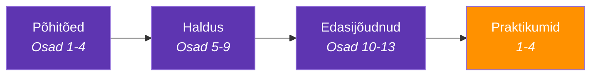

---
tags:
  - TLS
---

# Sissejuhatus

## Miks see kursus?

Iga kord, kui sa avad veebilehe, kontrollid pangakontot või saadad sõnumi, toimub taustal krüptograafiline tants. Sinu brauser ja server lepivad kokku saladuses, mida keegi teine ei tea. See kursus näitab, kuidas see kõik töötab.

Kursus on mõeldud IT-süsteemide nooremspetsialistidele ja teistele IT-valdkonna õppijatele, kes puutuvad kokku sertifikaadihalduse, HTTPS-i ja turvalise võrguühenduse seadistamisega.

---

## Mida sa õpid?

*Joonis 0.1. Kursuse ülesehitus ja läbimise järjekord*

| Plokk | Teemad |
|-------|--------|
| **Põhitõed** (1-4) | SSL/TLS/HTTPS, PKI, käepigistus, sertifikaadid |
| **Haldus** (5-9) | Failivormingud, keystore/truststore, elutsükkel, automatiseerimine |
| **Edasijõudnud** (10-13) | Probleemide lahendamine, mTLS, PQC, Eesti PKI |
| **Praktikumid** (1-4) | CA loomine, sertifikaadi analüüs, Vault, post-quantum |

---

## Tööriistad

Selles kursuses kasutame peamiselt **OpenSSL** ja **bash** terminali käske.

OpenSSL on avatud lähtekoodiga krüptograafiatööriist, mida võib nimetada krüptograafia Šveitsi armeenugaks — sellega saab genereerida võtmeid, luua sertifikaate, testida ühendusi ja palju muud. See on eelinstallitud peaaegu igas Linuxi ja macOS süsteemis.

Lisaks OpenSSL-ile kasutame kursuses ka `curl` (HTTP päringud), `docker` (Vault ja OQS keskkonnad) ning `keytool` (Java keystore/truststore).

Kõiki tööriistu õpid kasutama praktikumides — seal on käsud koos selgitustega samm-sammult läbi tehtud. Käskude kiireks meeldetuletuseks on olemas ka [Spikker](../spikker.md).

---

## Kuidas kursust läbida?

1. **Loe teooria läbi** - iga osa lõpus on enesekontrolli küsimused
2. **Tee praktikumid** - need kinnistavad teooriat päris käskudega
3. **Kasuta spikrit** - kõik olulised käsud on ühes kohas

!!! tip "Soovitus"
    Ära proovi kõike korraga selgeks saada. Alusta põhitõdedest, tee esimene praktikum ära, ja liigu edasi siis, kui tunned end kindlalt.

---

## Enesekontroll

??? question "1. Miks on selles kursuses vaja Linuxi käsurida?"
    Sertifikaatide loomine, haldamine ja tõrkeotsing toimub käsureal — graafilised tööriistad peidavad olulisi detaile. Serverid, kus sertifikaate paigaldatakse, on enamasti Linuxi-põhised ja ligipääs on ainult terminali kaudu.

??? question "2. Miks on kursus jagatud kolme plokki (põhitõed → haldus → edasijõudnud)?"
    Iga plokk ehitab eelmisele peale. Ilma põhitõdedeta (mis on sertifikaat, kuidas TLS töötab) ei saa aru haldusest (kuidas sertifikaate hallata). Edasijõudnud teemad (tõrkeotsing, PQC) eeldavad mõlema eelneva mõistmist.

??? question "3. Kujuta ette, et kolleeg küsib: 'Miks ma pean sertifikaatidest midagi teadma, see on ju admini töö?' Mida sa vastaksid?"
    Sertifikaadid puudutavad kõiki IT-rolle: arendaja peab teadma, miks HTTPS ei tööta tema testserveris; DevOps peab automatiseerima uuendusi; turvaspetsialist peab auditeerima. Aegunud sertifikaat võib kogu teenuse maha võtta — see pole ainult admini probleem.
