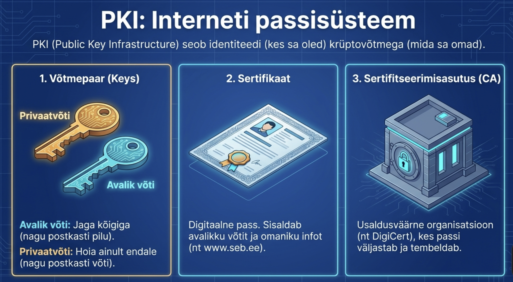

# Osa 2 - Mis on PKI ehk avaliku võtme infrastruktuur?

## Usalduse probleem

Internet on kummaline koht. Sa räägid masinatega, mida pole kunagi näinud, ettevõtetega teises maailma otsas, inimestega, keda sa ei tunne. Kuidas sa tead, et see, kellega sa räägid, on tõesti see, kes ta väidab end olevat?

Päriselus lahendame seda probleemi dokumentidega. Kui keegi ütleb, et ta on arst, saad sa küsida diplomit. Kui keegi väidab, et ta on Eesti kodanik, on tal pass. Need dokumendid töötavad, sest me usaldame nende väljastajaid — ülikoole, valitsusi, ametlikke asutusi.

PKI ehk Public Key Infrastructure on interneti vastus samale probleemile. See on süsteem, mis võimaldab veebisaitidel ja serveritel tõestada oma identiteeti viisil, mida me saame usaldada.

## Avalik ja privaatvõti

PKI põhineb ühel väga elegantsel matemaatilisel nõksul: võtmepaaridel. Kujuta ette, et sul on kaks võtit, mis on omavahel seotud. Üks on avalik — seda võid anda igaühele. Teine on privaatne — seda hoiad ainult enda teada.

Need võtmed töötavad paaridena. Kui keegi krüpteerib sõnumi sinu avaliku võtmega, saad ainult sina seda oma privaatvõtmega avada. Vastupidi — kui sina krüpteerid midagi oma privaatvõtmega, saab igaüks sinu avaliku võtmega kontrollida, et see tõesti sinult tuli.

See on nagu erikast lukuga postkast. Igaüks saab kirja sisse panna, sest pilu on avatud. Aga ainult sinul on võti, millega kirju välja võtta. Või kujuta ette allkirja — igaüks saab seda näha ja kontrollida, aga ainult sina saad seda teha.

## Sertifikaadid — digitaalsed passid

Avalik võti üksi ei lahenda usalduse probleemi. Kui keegi annab sulle avaliku võtme ja ütleb "see on panga võti", kuidas sa tead, et see pole petis?

Siin tulevad mängu sertifikaadid. Sertifikaat on nagu digitaalne pass — see sisaldab avalikku võtit, infot selle kohta, kellele see kuulub, ja kõige olulisem — kellegi usaldusväärse allkirja.

Kui sa külastad panga veebilehte, saadab server sulle oma sertifikaadi. Sertifikaat ütleb: "See avalik võti kuulub SEB pangale ja selle on kinnitanud DigiCert." Sinu brauser kontrollib, kas usaldab DigiCerti. Kui usaldab, siis usaldab ka seda sertifikaati ja teab, et räägib tõesti SEBga.

## Sertifitseerimisasutused — usalduse ankrud

Sertifitseerimisasutused ehk CA-d (Certificate Authorities) on need organisatsioonid, kelle allkirju me usaldame. Neid on maailmas umbes sada ja sinu brauser teab neid kõiki. DigiCert, Let's Encrypt, GlobalSign — need nimed on sinu brauserisse sisse ehitatud kui usaldusväärsed.

Kuidas CA-d seda usaldust välja teenivad? Nad peavad järgima rangeid reegleid, läbima auditeid, hoidma oma võtmeid üliturvaliselt. Kui CA teeb jama — näiteks väljastab sertifikaadi kellelegi, kes pole see, kes ta väidab — võivad brauserid ta nimekirjast välja visata. See on juhtunud.

## Usaldusahel

Päriselus ei allkirjasta tippude tipp igat dokumenti ise. President ei kirjuta alla igale passile. Samamoodi töötab PKI: on olemas hierarhia.

Tipus on juur-CA. Selle võtit hoitakse super-turvalises kohas, sageli offline. Juur-CA allkirjastab vahe-CA-d, kes omakorda allkirjastavad lõppsertifikaate. Kui sinu brauser saab sertifikaadi, kontrollib ta kogu ahelat: kas server-sertifikaat on allkirjastatud vahe-CA poolt? Kas vahe-CA on allkirjastatud juur-CA poolt? Kas juur-CA on brauseri usaldatud nimekirjas?

See ahel peab olema terve. Kui üks lüli on katki — sertifikaat aegunud, allkiri ei klapi, CA pole usaldatud — siis brauser annab hoiatuse.

## Miks see töötab?

PKI töötab, sest see lahendab usalduse probleemi skaleeritavalt. Sa ei pea iga veebisaidiga isiklikult tutvuma. Sa usaldad käputäit CA-sid ja nemad kontrollivad teisi. See on nagu soovituste ahel: sa usaldad oma sõpra, sõber usaldab oma sõpra, nii jõuab usaldus kaugele.

Muidugi pole süsteem täiuslik. CA-d on rünnatavad. Valitsused võivad sundida CA-sid väljastama võltssertifikaate. Aga hetkel on see parim lahendus, mis meil on, ja miljonid turvalised ühendused iga päev tõestavad, et see enamasti töötab.

Järgmises osas vaatame, kuidas TLS käepigistus tegelikult käib — see tants, kus brauser ja server turvaliselt tuttavaks saavad.

