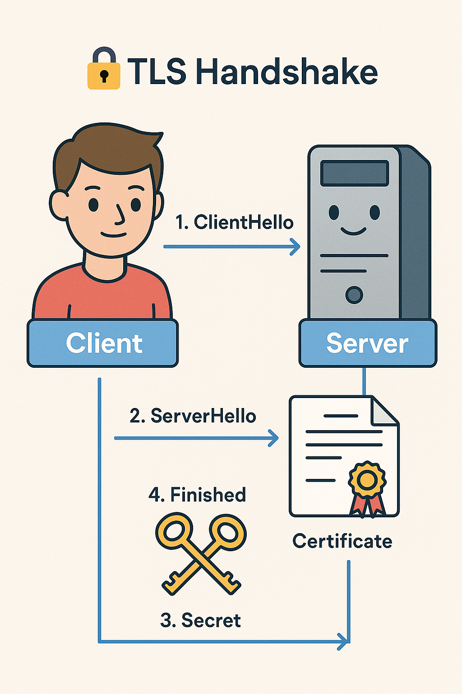

# Osa 3 - Kuidas TLS käepigistus töötab?

## Kaks võõrast kohtuvad

Iga kord, kui sa avad turvalise veebilehe, toimub kulisside taga kiire tants. Sinu brauser ja server — kaks masinat, kes pole kunagi varem kohtunud — peavad mõne sekundi jooksul kokku leppima, kuidas turvaliselt suhelda. Seda tantsu nimetatakse TLS käepigistuseks.

Mõtle sellest nagu kahe spioonina kohtumine. Nad ei tunne teineteist, nad ei usalda kedagi, aga neil on vaja vahetada salajast infot. Kuidas nad seda teevad nii, et keegi kolmas ei saaks pealt kuulata?

> **🔄 TLS KÄEPIGISTUS SAMMHAAVAL:**
> 
> ```
> 1. Brauser → Server:  "Tere! Ma toetan TLS 1.2, 1.3 ja neid šifreid..."
> 2. Server → Brauser:  "OK, TLS 1.3. Siin on mu sertifikaat."
> 3. Brauser:           Kontrollib sertifikaati (CA, nimi, kehtivus)
> 4. Brauser ↔ Server:  Võtmevahetus (Diffie-Hellman / ECDHE)
> 5. Mõlemad:           Genereerivad sessioonivõtme
> 6. 🔒 Turvaline tunnel on avatud!
> ```

## Esimene samm: "Tere, ma tahan turvaliselt rääkida"

Kõik algab sellest, et sinu brauser saadab serverile teate: "Tere! Ma olen brauser, ma toetan neid TLS versioone ja neid krüpteerimisviise. Siin on ka juhuslik number, mille ma just genereerisin."

See on nagu siseneda ruumi ja öelda: "Ma räägin eesti, inglise ja vene keelt. Kumb sulle sobib?"

## Teine samm: Server vastab ja näitab passi

Server vaatab, mida brauser pakub, ja valib variandi, mis mõlemale sobib. Siis saadab ta vastuse: "Olgu, räägime TLS 1.3 ja kasutame seda krüpteerimist. Siin on minu sertifikaat — minu digitaalne pass. Ja siin on minu enda juhuslik number."

> **🔍 MIDA BRAUSER KONTROLLIB:**
> 
> - ✅ Kas sertifikaat on kehtiv (pole aegunud)?
> - ✅ Kas selle on allkirjastanud usaldatud CA?
> - ✅ Kas sertifikaadi nimi vastab veebilehe aadressile?
> - ✅ Kas sertifikaat pole tühistatud (OCSP/CRL)?

Kui midagi on valesti — sertifikaat aegunud, vale nimi, tundmatu CA — näed sa seda punast hoiatust brauseris.

## Kolmas samm: Saladuse loomine

Nüüd tuleb nutikus osa. Brauser ja server peavad kokku leppima saladuses, mida keegi kolmas ei tea. Aga kuidas seda teha, kui keegi võib pealt kuulata?

Lahendus on matemaatiline ime nimega võtmevahetus. Kujuta ette, et sina ja sõber seisate rahvarohke tänava kahes otsas. Te mõlemad valite salaja värvi ja segatee selle avaliku värviga. Siis vahetate segatud värve. Nüüd lisab igaüks teise segatud värvile oma salajase värvi. Matemaatiliselt jõuate mõlemad sama lõppvärvini, aga keegi, kes nägi ainult segatud värve tänaval, ei suuda seda lõppvärvi arvutada.

> **💡 DIFFIE-HELLMAN LIHTSALT:**
> 
> ```
> Avalik värv:     🟡 (kollane)
> 
> Sinu salajane:   🔴 → Segad: 🟡+🔴 = 🟠 → Saadad sõbrale
> Sõbra salajane:  🔵 → Segab: 🟡+🔵 = 🟢 → Saadab sulle
> 
> Sina:  🟢 + 🔴 = 🟤 (lõppvärv)
> Sõber: 🟠 + 🔵 = 🟤 (sama lõppvärv!)
> 
> Pealtkuulaja nägi ainult 🟡, 🟠, 🟢 — ei suuda 🟤 arvutada!
> ```

TLS-is kasutatakse selleks Diffie-Hellmani algoritmi või selle elliptiliste kõverate versiooni (ECDHE). Tulemuseks on jagatud saladus, mida ainult brauser ja server teavad.

## Neljas samm: Turvaline tunnel on avatud

Nüüd, kui mõlemal poolel on sama saladus, genereeritakse sellest sessioonivõtmed. Need võtmed krüpteerivad kogu ülejäänud suhtluse. 

> **📊 KAKS KRÜPTOGRAAFIA TÜÜPI:**
> 
> | Tüüp | Kiirus | Kasutus TLS-is |
> |------|--------|----------------|
> | **Asümmeetriline** (RSA, ECDH) | Aeglane | Ainult käepigistus |
> | **Sümmeetriline** (AES) | Kiire | Kogu andmevahetus |
> 
> Seega: aeglast meetodit kasutatakse ainult selleks, et kokku leppida kiires meetodis.

Käepigistus on läbi. Nüüd liigub kõik — HTML, pildid, paroolid, krediitkaardid — krüpteeritud tunnelis.

## TLS 1.2 versus 1.3

> **⚡ TLS 1.3 EELISED:**
> 
> | Omadus | TLS 1.2 | TLS 1.3 |
> |--------|---------|---------|
> | Käepigistuse kiirus | 2 edasi-tagasi | 1 edasi-tagasi |
> | Nõrgad šifrid | Lubatud | Eemaldatud |
> | Forward secrecy | Valikuline | Kohustuslik |
> | 0-RTT režiim | Ei | Jah |

Vana TLS 1.2 käepigistus vajas kaks edasi-tagasi reisi. Brauser saatis teate, ootas vastust, saatis veel teate, ootas jälle. See võttis aega.

TLS 1.3, mis sai standardiks 2018. aastal, lahendas selle. Käepigistus toimub ühe reisiga. Brauser saadab esimese teatega juba oma võtmevahetuse info, nii et server saab kohe vastata täieliku infoga. Tulemus: kiirem ühendus.

TLS 1.3 eemaldas ka kõik nõrgad krüpteerimisviisid. Vanas versioonis said valida halbade variantide vahel. Uues versioonis on ainult head valikud. See teeb seadistamise lihtsamaks — raskem on kogemata midagi valesti panna.

## Edastussaladus — miks see oluline on?

> **🔐 FORWARD SECRECY:**
> 
> Isegi kui ründaja saab **kunagi tulevikus** kätte serveri privaatvõtme, ei saa ta vanu salvestatud ühendusi lahti krüpteerida.
> 
> **Kuidas?** Iga ühenduse jaoks genereeritakse uued ajutised võtmed, mis kustutatakse pärast kasutamist.

Üks TLS 1.3 parimaid omadusi on kohustuslik edastussaladus (forward secrecy). See tähendab, et isegi kui keegi saab kunagi kätte serveri privaatvõtme, ei saa ta vanu salvestatud ühendusi lahti krüpteerida.

See on nagu kasutada iga vestluse jaoks uut salakeelt ja siis see ära unustada.

## Kui käepigistus ebaõnnestub

> **⚠️ LEVINUD VEAD:**
> 
> | Veateade | Põhjus |
> |----------|--------|
> | `certificate has expired` | Sertifikaat aegunud |
> | `hostname mismatch` | Sertifikaadi nimi ei klapi URL-iga |
> | `unable to get local issuer` | Vahesertifikaat puudub |
> | `self signed certificate` | CA pole usaldatud |
> | `no shared cipher` | Protokolli/šifri mitteühilduvus |

Mõnikord näed brauseris hoiatust, et turvaline ühendus ebaõnnestus. Need hoiatused on olulised. Nad kaitsevad sind rünnakute eest, kus keegi üritab end serveri ja sinu vahele sokutada (man-in-the-middle). Kui näed sellist hoiatust päris pangalehel, on see tõsine ohumärk.

Järgmises osas vaatame sertifikaate lähemalt — mis neis tegelikult kirjas on ja kuidas neid tehakse.


