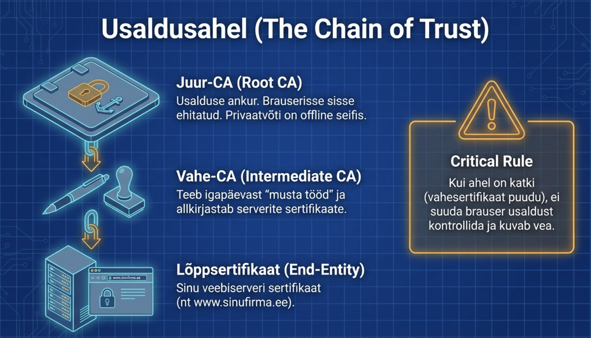
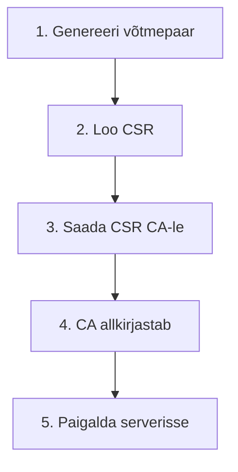
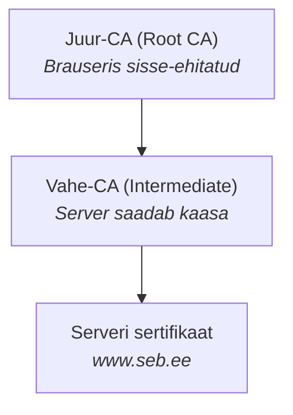

---
tags:
  - Sertifikaadid
  - PKI
---

# Sertifikaadid

<figure markdown="span">
  
  <figcaption>Joonis 4.1. Sertifikaadi usaldusahel ja CA roll (Talvik, 2025). Loodud tehisintellekti abil.</figcaption>
</figure>

## Digitaalne pass

Kujuta ette, et tahad avada pangakontot. Sa lähed kontorisse ja ütled: "Tere, mina olen Maria Tamm, tahan konto avada." Ametnik vaatab sind ja küsib: "Kuidas ma tean, et sa oled Maria Tamm?"

Sa näitad passi. Pass töötab, sest seal on sinu foto, sinu nimi, ja kõige olulisem - Eesti Vabariigi pitser. Ametnik usaldab passi, sest ta usaldab Eesti Vabariiki. Ta ei pea sind isiklikult tundma.

Sertifikaat on veebisaidi pass.[^rfc5280] Kui sinu brauser ühendub pangaga, ütleb server: "Tere, mina olen seb.ee." Brauser küsib: "Kuidas ma tean?" Server näitab sertifikaati. Sertifikaadil on serveri nimi, tema avalik võti, ja CA allkiri. Brauser usaldab sertifikaati, sest ta usaldab CA-d.

## Mida sertifikaat sisaldab?

| Väli | Kirjeldus | Näide |
|------|-----------|-------|
| **Subject** | Kellele kuulub | `CN=www.seb.ee, O=SEB` |
| **Issuer** | Kes allkirjastas (CA) | `CN=DigiCert Global Root CA` |
| **Not Before** | Kehtivuse algus | `Jan 1 00:00:00 2024` |
| **Not After** | Aegumiskuupäev | `Jan 1 00:00:00 2025` |
| **Public Key** | Avalik võti | RSA 2048-bit / ECDSA P-256 |
| **SAN** | Alternatiivsed nimed | `DNS:seb.ee, DNS:www.seb.ee` |
| **Signature** | CA digitaalallkiri | SHA256withRSA |

*Tabel 4.1. Sertifikaadi väljad (Cooper et al., 2008)*

Ava brauseris mõni turvaline leht ja kliki lukuikoonil. Sa näed sertifikaadi detaile.

**Subjekt** - see, kellele sertifikaat kuulub. Tavaliselt on see veebisaidi aadress, näiteks "www.seb.ee". Seal võib olla ka organisatsiooni nimi ja asukoht, aga see sõltub sertifikaadi tüübist.

**Väljastaja** - CA, kes sertifikaadi allkirjastas. Näiteks "DigiCert Global Root CA". See on see, keda sinu brauser usaldab.

**Kehtivusaeg** näitab, millal sertifikaat kehtima hakkas ja millal aegub. Tänapäeval on sertifikaadid tavaliselt aastaks, mõnikord isegi 90 päevaks.

**Avalik võti** on see matemaatiline kood, millega saab serverile krüpteeritud sõnumeid saata.

**Digitaalallkiri** - CA kinnitus, et kõik eelnev on õige.

## Sertifikaadi tüübid

| Tüüp | Kontroll | Aeg | Hind | Näitab |
|------|----------|-----|------|--------|
| **DV** (Domain) | Ainult domeeni omandiõigus | Minutid | Tasuta/odav | Ainult domeeni |
| **OV** (Organization) | + Organisatsiooni kontroll | Päevad | $ | Domeeni + firma |
| **EV** (Extended) | + Põhjalik taustakontroll | Nädalad | $$ | Domeeni + firma |

*Tabel 4.2. Sertifikaatide valideerimistasemed*

**Domain Validation (DV)** on kõige lihtsam. CA kontrollib ainult seda, et sa kontrollid domeeni. Tavaliselt tähendab see e-kirja saatmist domeeni aadressile või faili lisamist veebiserverisse. See võtab minuteid ja on sageli tasuta - Let's Encrypt teeb just seda.

**Organization Validation (OV)** on samm edasi. CA kontrollib, et organisatsioon on päris - vaatab registriandmeid, helistab ehk isegi telefoninumbril. See võtab päevi.

**Extended Validation (EV)** on kõige rangem. CA teeb põhjaliku taustakontrolli. See võtab nädalaid ja maksab korralikult.

!!! tip "Praktiline nõuanne"
    Enamikule veebilehtedele piisab DV sertifikaadist (Let's Encrypt). OV/EV on vajalikud ainult siis, kui regulatsioonid seda nõuavad või tahad näidata organisatsiooni nime sertifikaadis.

## Kuidas sertifikaati saada?

*Joonis 4.2. Sertifikaadi taotlemise protsess*

Protsess algab sellest, et sa lood endale võtmepaari - avaliku ja privaatvõtme. Privaatvõti jääb sulle, seda ei näita kellelegi.

Siis lood CSR-i ehk Certificate Signing Requesti - sertifikaadi allkirjastamise taotluse. See sisaldab sinu avalikku võtit ja infot, mida tahad sertifikaadile panna.

CSR-i saadad CA-le. CA kontrollib sind ja kui kõik on korras, allkirjastab sinu avaliku võtme ja info oma privaatvõtmega. Tulemuseks on sertifikaat.

## Usaldusahel praktikas

*Joonis 4.3. Usaldusahel praktikas*

Kui server saadab brauserile sertifikaadi, saadab ta tegelikult terve keti. Kõige all on serveri enda sertifikaat, siis vahe-CA sertifikaat.

Brauser kõnnib seda ketti mööda üles. Ta kontrollib iga sertifikaadi allkirja järgmise sertifikaadi võtmega. Lõpuks jõuab ta juur-CA-ni, mida ta juba usaldab (see on brauserisse sisse ehitatud).

!!! danger "Levinud viga"
    Server saadab ainult oma sertifikaadi, aga mitte vahesertifikaati. Brauser ei suuda ahelat ehitada. Lahendus: `cat server.crt intermediate.crt > fullchain.crt`

## Ise-allkirjastatud sertifikaadid

Mõnikord pole CA-d vaja. Sa saad ise oma võtmega oma sertifikaadi allkirjastada. Seda nimetatakse ise-allkirjastatud (self-signed) sertifikaadiks.

!!! info "Ise-allkirjastatud sertifikaadid"
    **Sobib:** testimine ja arendus, sisemised teenused (kui CA lisatud truststoresse). **Ei sobi:** avalikud veebilehed, tootmiskeskkond ilma sisemise CA-ta.

Probleem on selles, et keegi seda ei usalda. Brauserid annavad hoiatuse, sest nad ei tunne sinu allkirja.

## Sertifikaadi eluiga

| Tüüp | Tüüpiline kehtivus | Põhjus |
|------|-------------------|--------|
| Let's Encrypt | 90 päeva | Sunnib automaatikat |
| Avalik CA | Max 398 päeva | CA/Browser Forum reegel[^cabforum] |
| Sisemine CA | Sinu otsustada | Tüüpiliselt 1-2 aastat |
| Juur-CA | 10-20 aastat | Harva muudetakse |

*Tabel 4.3. Sertifikaatide kehtivusajad*

Sertifikaadid ei kesta igavesti. Nad aeguvad ja siis tuleb uued teha.

Miks nad aeguvad? Turvalisuse pärast. Mida kauem võti kasutusel on, seda suurem on tõenäosus, et see lekib või muutub matemaatiliselt nõrgemaks.[^ristic] Lühike eluiga sunnib regulaarset uuendamist.

Let's Encrypt[^letsencrypt] andis tõuke lühikestele sertifikaatidele - nende sertifikaadid kehtivad ainult 90 päeva. See sunnib automaatikat kasutusele võtma, mis on pikemas perspektiivis parem kui käsitsi uuendamine.

Järgmises osas vaatame sertifikaatide failivorminguid - need .pem, .crt, .p12 failid, mis alguses segadust tekitavad.

---

## Kokkuvõte

Sertifikaat on digitaalne pass, mis sisaldab avalikku võtit, omaniku infot ja CA allkirja. DV, OV ja EV erinevad kontrolli ranguse poolest. Sertifikaadi saamiseks luuakse CSR, mille CA allkirjastab. Usaldusahel (juur-CA → vahe-CA → server) peab olema terve. Sertifikaadid aeguvad — Let’s Encrypt 90 päeva, avalikud CA-d max 398 päeva.

---

## Enesekontroll

??? question "1. Mis vahe on DV, OV ja EV sertifikaatidel?"
    DV kontrollib ainult domeeni omanikuõigust (minutid, tasuta). OV kontrollib lisaks organisatsiooni (päevad, tasuline). EV teeb põhjaliku taustakontrolli (nädalad, kallis). Enamikule lehtedele piisab DV-st.

??? question "2. Mis on CSR ja milleks seda kasutatakse?"
    CSR (Certificate Signing Request) on taotlus, mille saadad CA-le. See sisaldab sinu avalikku võtit ja infot, mida tahad sertifikaadile panna, ning on allkirjastatud sinu privaatvõtmega.

??? question "3. Miks sertifikaadid aeguvad?"
    Lühike eluiga sunnib regulaarset uuendamist ja vähendab kahjuakent võtmelekke korral. Let's Encrypt sertifikaadid kehtivad 90 päeva, avalikud CA-d max 398 päeva.

??? question "4. Mis on ise-allkirjastatud sertifikaat ja millal seda kasutada?"
    Ise-allkirjastatud sertifikaadil pole CA allkirja - sa allkirjastad selle ise. Sobib testimiseks ja arenduseks, aga mitte tootmiseks, sest brauserid ei usalda seda ja annavad hoiatusi.

[^rfc5280]: Cooper, D. et al. (2008). *Internet X.509 Public Key Infrastructure Certificate and Certificate Revocation List (CRL) Profile*. RFC 5280. https://datatracker.ietf.org/doc/html/rfc5280
[^letsencrypt]: Let's Encrypt. (2024). *How It Works*. https://letsencrypt.org/how-it-works/
[^cabforum]: CA/Browser Forum. (2023). *Baseline Requirements*. https://cabforum.org/baseline-requirements/
[^ristic]: Ristić, I. (2022). *Bulletproof TLS and PKI*. Feisty Duck. https://www.feistyduck.com/books/bulletproof-tls-and-pki/
