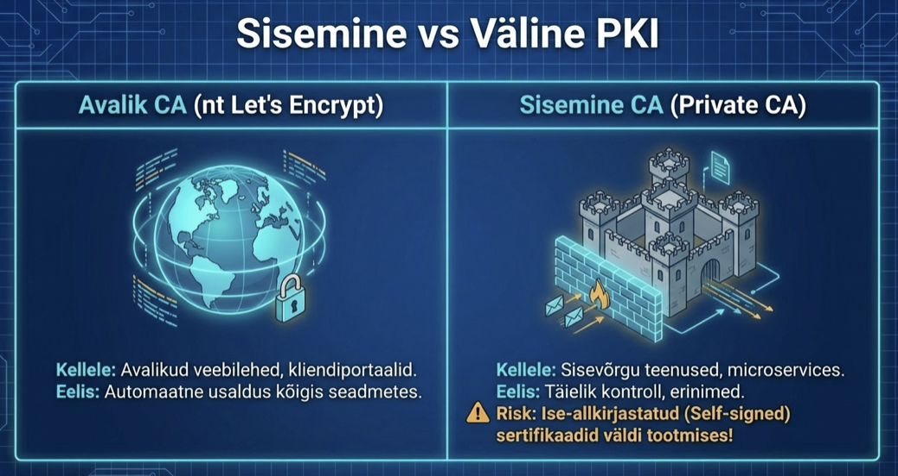

---
tags:
  - PKI
  - Sertifikaadid
---

# Sisemised ja välised sertifikaadid

<figure markdown="span">
  
  <figcaption>Joonis 6.1. Sisemiste ja väliste sertifikaatide kasutamine (Talvik, 2025). Loodud tehisintellekti abil.</figcaption>
</figure>

## Kaks maailma

Sertifikaadid jagunevad laias laastus kahte leeri: avalikud ja sisemised. Vahe pole tehniline - mõlemad töötavad sama matemaatikaga. Vahe on selles, kes neid usaldab ja milleks neid kasutatakse.

Avalikud sertifikaadid tulevad avalikelt CA-delt - Let's Encrypt, DigiCert, GlobalSign ja paljud teised. Nende CA-de juursertifikaadid on sisse ehitatud igasse brauserisse, igasse telefoni, igasse operatsioonisüsteemi. Kui sa paned oma veebilehele Let's Encrypt sertifikaadi, usaldab seda iga külastaja maailmas automaatselt.

Sisemised sertifikaadid tulevad sinu enda CA-lt. Sa lood oma juursertifikaadi ja hakkad sellega allkirjastama. Probleem: mitte keegi maailmas ei usalda seda, välja arvatud masinad, kuhu sa oma juursertifikaadi ise installid.[^ristic]

## Millal kasutada avalikku CA-d?

Vastus on lihtne: alati, kui sinu teenust kasutavad inimesed väljastpoolt sinu organisatsiooni.

Veebileht, mida külastavad kliendid? Avalik CA. Avalik API, millega ühenduvad partnerid? Avalik CA. Mobiilirakenduse backend? Avalik CA.

Avaliku CA kasutamise plussid on selged. Kõik juba usaldavad sind - ei pea midagi installima, seadistama, levitama. Let's Encrypt on tasuta, automatiseeritud ja töötab hästi. Sul pole vaja ise CA infrastruktuuri hallata.

Miinused? Sa sõltud kolmandast osapoolest. Kui CA-l on probleeme, on sul probleeme. Ja sa pead oma domeeni omanikuks olema - avalik CA ei anna sulle sertifikaati võõra domeeni jaoks.

## Millal kasutada sisemist CA-d?

Kui sinu teenuseid kasutavad ainult sinu enda masinad ja inimesed, muutub sisemine CA mõttekaks.

Kujuta ette suurt ettevõtet. Seal on sadu sisemisi teenuseid: andmebaasid, sõnumijärjekorrad, monitooringusüsteemid, sisemised APIid. Need kõik peavad omavahel turvaliselt rääkima, aga mitte keegi väljastpoolt ei pea neid usaldama.

Sisemine CA annab sulle täieliku kontrolli. Sa otsustad, mis nimega sertifikaate väljastad. Sa otsustad, kui kaua nad kehtivad. Sa ei maksa iga sertifikaadi eest. Sa saad väljastada sertifikaate sisevõrgu domeenidele nagu "andmebaas.sisemine" või IP-aadressidele, mida avalikud CA-d tavaliselt ei tee.

Miinus on see, et sa pead ise seda CA-d haldama. Sa pead oma juursertifikaadi installima igale masinale, mis neid teenuseid kasutab. Sa pead jälgima aegumisi ja uuendama sertifikaate. Kui sinu CA privaatvõti lekib, on kõik sinu sisemised sertifikaadid kompromiteeritud.

## Usalduse levitamine

Sisemise CA puhul on suurim väljakutse usalduse levitamine. Kuidas sa saavutad selle, et kõik sinu masinad usaldavad sinu CA-d?

Operatsioonisüsteemidel on usaldatud CA-de nimekirjad. Linuxis on see tavaliselt /etc/ssl/certs kataloog. Windowsis on sertifikaadihaldur. Kui sa lisad oma juursertifikaadi sinna, hakkab see masin usaldama kõiki sinu CA allkirjastatud sertifikaate.

Suurtes organisatsioonides tehakse seda automaatikaga. Active Directory võib sertifikaate levitada kõigile domeeni masinatele. Ansible, Puppet või Chef saavad seda teha Linuxi serveritele. Mobiiliseadmete haldus (MDM) saab seda teha telefonidele ja tahvlitele.

Probleem tekib siis, kui masinad pole sinu kontrolli all. Kui sinu töötajad kasutavad isiklikke seadmeid, ei saa sa neile oma juursertifikaati peale sundida. Kui partnerid peavad sinu sisemise teenusega ühenduma, peavad nemad ka sinu CA-d usaldama.

## Kahekihiline CA

Päris maailmas ei kasuta sa juur-CA-d otse sertifikaatide allkirjastamiseks. See on liiga riskantne - kui juur-CA privaatvõti lekib, on katastroof.

Selle asemel lood sa vahe-CA. Juur-CA allkirjastab vahe-CA sertifikaadi ja läheb siis seifi - sõna otseses mõttes, füüsilisse seifi, offline. Vahe-CA teeb igapäevast tööd: allkirjastab serverite sertifikaate.

Kui vahe-CA võti lekib, on olukord halb, aga mitte katastroofiline. Sa tühistad vahe-CA, lood uue ja jätkad. Juur-CA jääb puutumata, nii et sa ei pea kogu usaldusstruktuuri ümber ehitama.

## Sertifikaatide tühistamine

Mis juhtub, kui sertifikaat satub valedesse kätesse? Võti lekib, töötaja lahkub, server häkitakse - sertifikaat tuleb tühistada.

Avalikud CA-d kasutavad selleks CRL-i (Certificate Revocation List) ja OCSP-d (Online Certificate Status Protocol). CRL on nimekiri tühistatud sertifikaatidest, mida brauserid perioodiliselt alla laevad. OCSP on reaalajas päring: "Kas see konkreetne sertifikaat on veel kehtiv?"

Sisemise CA puhul pead sa ise neid mehhanisme üles seadma. Või kui sinu keskkond on piisavalt väike, võid lihtsalt kiiresti kõigile masinatele uued sertifikaadid levitada.

## Ise-allkirjastatud sertifikaadid

Kõige lihtsam variant on ise-allkirjastatud sertifikaat - sa genereerid võtme ja allkirjastad ise oma sertifikaadi. Pole CA-d, pole hierarhiat.

See sobib testimiseks ja arenduseks. Aga mitte tootmiseks. Brauserid annavad hoiatusi, sest nad ei tunne sind. Kasutajad peavad käsitsi erandeid lisama. See on turvarisk - inimesed harjuvad hoiatusi ignoreerima.

## Praktiline nõuanne

Kui alles alustad, ära keeruta üle. Kasuta Let's Encrypt[^letsencrypt] avalike teenuste jaoks - see on tasuta, automaatne ja töötab. Sisemiste teenuste jaoks võid alustada ise-allkirjastatud sertifikaatidega, kui neid on vähe.

Kui sisemisi teenuseid on palju ja organisatsioon kasvab, tasub investeerida korralikku sisemisse CA-sse. HashiCorp Vault,[^vault] Smallstep,[^smallstep] EJBCA - on tööriistu, mis teevad CA haldamise lihtsamaks.

Kõige hullem olukord on segadus: osad teenused kasutavad avalikke sertifikaate, osad sisemisi, osad ise-allkirjastatuid, keegi ei tea, mis kuhu kuulub. See on turvarisk ja halduspeavalu. Parem on selge poliitika: need teenused kasutavad seda, need teist.

Järgmises osas vaatame keystoore ja truststoore - kuidas Java ja teised süsteemid sertifikaate hoiustavad.

---

## Kokkuvõte

Avalikud sertifikaadid (Let’s Encrypt jt) sobivad välise liikluse jaoks — kõik usaldavad automaatselt. Sisemised sertifikaadid annavad täieliku kontrolli, aga vajavad ise haldamist ja usalduse levitamist. Kahekihiline CA (juur offline + vahe-CA töötamas) vähendab lekkeriske. Selge poliitika on parem kui segadus.

---

## Enesekontroll

??? question "1. Millal kasutada avalikku CA-d ja millal sisemist?"
    Avalik CA (nt Let's Encrypt) - kui teenust kasutavad väljastpoolt tulevad kasutajad. Sisemine CA - kui teenuseid kasutavad ainult sinu enda masinad ja inimesed. Sisemise CA eelis on täielik kontroll, miinus on halduskoormus.

??? question "2. Miks kasutatakse kahekihilist CA struktuuri?"
    Juur-CA hoitakse offline seifis, vahe-CA teeb igapäevast tööd. Kui vahe-CA võti lekib, tühistad vahe-CA ja lood uue. Juur-CA jääb puutumata, nii et kogu usaldusstruktuuri ei pea ümber ehitama.

??? question "3. Kuidas levitatakse sisemise CA usaldust masinatele?"
    Juur-CA sertifikaat lisatakse masinate usaldatud CA nimekirja: Linuxis /etc/ssl/certs, Windowsis sertifikaadihaldur, Active Directory, Ansible/Puppet automatiseerimisega või MDM kaudu mobiilseadmetele.

[^letsencrypt]: Let's Encrypt. (2024). *Documentation*. https://letsencrypt.org/docs/
[^vault]: HashiCorp. *Vault PKI Secrets Engine*. https://developer.hashicorp.com/vault/docs/secrets/pki
[^smallstep]: Smallstep. *Step CA Documentation*. https://smallstep.com/docs/step-ca/
[^ristic]: Ristić, I. (2022). *Bulletproof TLS and PKI*. Feisty Duck. https://www.feistyduck.com/books/bulletproof-tls-and-pki/
