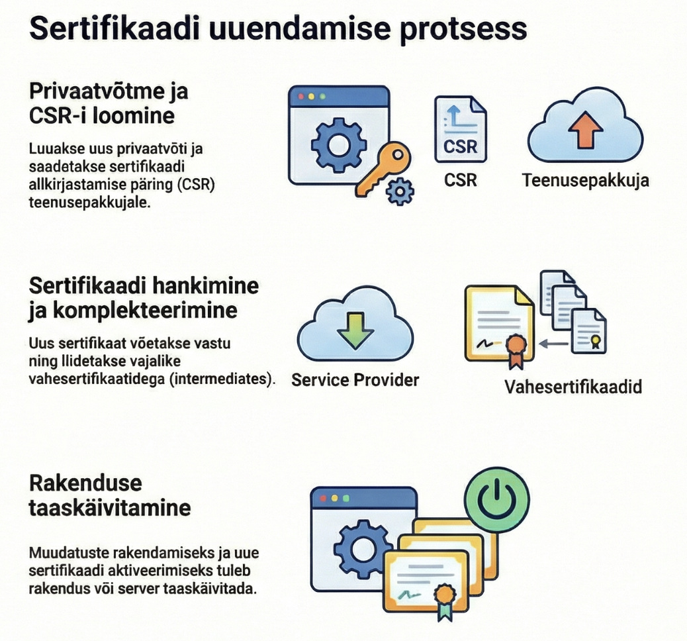

---
tags:
  - Sertifikaadid
  - Automatiseerimine
---

# Sertifikaatide elutsükkel ja võtmete rotatsioon

## Sertifikaadid ei kesta igavesti

Igal sertifikaadil on sünnikuupäev ja surmakuupäev. See pole bug, see on feature. Aegumised sunnivad regulaarset uuendamist, mis tähendab regulaarset turvakontrolli.

Let's Encrypt tegi julge otsuse: nende sertifikaadid kehtivad ainult 90 päeva. Esialgu tundus see hullumeelsena - kes tahab iga kolme kuu tagant sertifikaate uuendada? Aga see sundis kogu tööstust automaatikat kasutusele võtma. Ja automaatika on parem kui käsitsi töö, mis unustatakse.

Tänapäeval on avalikud CA-d piiratud maksimum 398 päevaga.[^cabforum] Sisemised CA-d võivad väljastada pikemaid sertifikaate, aga see pole tingimata hea mõte. Mida pikem sertifikaat, seda rohkem aega on ründajal, kui ta võtme kätte saab.

## Sertifikaadi elutsükkel

Sertifikaat sünnib CSR-ist. Sa genereerid võtmepaari, lood taotluse, CA allkirjastab selle. Sertifikaat hakkab kehtima - mõnikord kohe, mõnikord tulevikus.

Aktiivne elu on periood, mil sertifikaat töötab. Server kasutab seda klientide autentimiseks, kliendid kontrollivad seda ja usaldavad.

Uuendamine peaks toimuma enne aegumist. Mitte päev enne, vaid piisava varuga - nädal, kaks, kuu. Kui automaatika kokku jookseb, on aega käsitsi sekkuda.

Aegumise järel sertifikaat lakkab töötamast. Ühendused ebaõnnestuvad. Brauserid annavad hoiatusi. Kliendid ei pääse ligi. See on katastroof, mida tahad vältida.

Mõnikord sertifikaat tühistatakse enne aegumist. Võti lekib, töötaja lahkub, server häkitakse - põhjuseid on palju. Tühistatud sertifikaat peaks lakkama töötamast kohe, mitte aegumiskuupäeval.

## Uuendamise anatoomia

Sertifikaadi uuendamine võib tähendada kahte asja: sama võtmega uut sertifikaati või uut võtit koos uue sertifikaadiga.

Sama võtmega uuendamine on lihtsam. Sa genereerid uue CSR-i sama privaatvõtmega, CA allkirjastab selle, sa saad uue sertifikaadi. Privaatvõtit ei pea vahetama, konfiguratsioon jääb samaks.

Võtme rotatsioon on turvalisem, aga keerulisem. Sa genereerid täiesti uue võtmepaari, lood uue CSR-i, saad uue sertifikaadi. Kõik, mis vana võtit kasutab, tuleb uuendada.

Miks võtit roteerida? Sest mida kauem võti kasutusel on, seda rohkem on olnud võimalusi selle lekkimiseks. Mida sagedamini roteerid, seda lühem on aken, mil võimalik leke kahjustada saab.

Paljud organisatsioonid roteerivad võtmeid iga sertifikaadi uuendamisel. Mõned roteerivad harvemini. Nulltolerantsiga keskkonnad roteerivad pidevalt - sertifikaadid kehtivad tunde, mitte päevi.

## Automaatika on kohustuslik

Kui sul on rohkem kui paar sertifikaati, on käsitsi haldamine tee katastroofini. Keegi unustab, keegi on puhkusel, keegi ei tea, et tema vastutab.

ACME protokoll,[^acme] mille Let's Encrypt[^letsencrypt] kuulsaks tegi, on sertifikaatide automaatse uuendamise standard. Certbot, acme.sh ja teised tööriistad kasutavad seda. Nad kontrollivad sertifikaadi aegumist, genereerivad uue CSR-i, tõestavad domeeni omandiõigust, saavad uue sertifikaadi ja installivad selle. Kõik automaatselt.

```bash
# Certbot uuendab kõiki sertifikaate, mis on aegumas
certbot renew

# Tüüpiliselt käivitatakse croni või systemd timeriga
# Kaks korda päevas on mõistlik
0 0,12 * * * certbot renew --quiet
```

Sisemiste sertifikaatide jaoks on teised tööriistad. HashiCorp Vault genereerib sertifikaate API kaudu ja saab seda teha automaatselt. Cert-manager Kubernetesis jälgib sertifikaate ja uuendab neid. Smallstep pakub automaatset sisemist CA-d.

## Monitooring

Isegi automaatikaga võib midagi viltu minna. Seepärast tuleb sertifikaate monitoorida.

Lihtne lähenemine: script, mis kontrollib sertifikaatide aegumiskuupäevi ja annab märku, kui jääb alla kuu.

```bash
# Kontrolli sertifikaadi aegumist
openssl x509 -in sertifikaat.crt -noout -enddate

# Kontrolli, kas aegub 30 päeva jooksul
openssl x509 -in sertifikaat.crt -noout -checkend 2592000
```

Parem lähenemine: tsentraliseeritud monitooring. Prometheus ssl_exporter, Nagios pluginad, kommertslahendused - need skaneerivad sinu servereid ja annavad ühe koha, kust kõiki sertifikaate jälgida.

Hoiatuste tasemed: 30 päeva enne aegumist - info. 14 päeva - hoiatus. 7 päeva - kriitiline. Päev enne - paanika.

## Kui midagi läheb valesti

Server enam ei tööta. Sertifikaat aegus. Mis nüüd?

Esiteks: ära paanitse. Uue sertifikaadi saamine võtab minuteid, mitte tunde.

Kui kasutad Let's Encrypt'i: käivita certbot renew --force-renewal. See sunnib uuendamist isegi kui vana sertifikaat on veel kehtiv (tehniliselt).

Kui kasutad avalikku CA-d: genereeri uus CSR, taotle kiiruuendust. Paljud CA-d pakuvad kiirmenetlust kriitilistes olukordades.

Kui kasutad sisemist CA-d: sul peaks olema õigus ise sertifikaate väljastada. Tee seda.

Pärast kriisi: analüüsi, miks automaatika ei töötanud. Paranda. Testi. Dokumenteeri.

## Võtmeleke

Hullem kui aegumine on võtmeleke. Keegi sai sinu privaatvõtme.

Esimene samm: tühista sertifikaat. Avalikus CA-s on selleks tavaliselt veebiliides või API. Tühistamine lisab sertifikaadi CRL-i ja OCSP hakkab vastama "tühistatud".

Teine samm: genereeri täiesti uus võtmepaar. Vana võti on kompromiteeritud - ära kasuta seda enam kunagi.

Kolmas samm: hangi uus sertifikaat uue võtmega.

Neljas samm: uuri, kuidas leke juhtus. See on oluline, et see ei korduks.

Tähtis: sertifikaadi tühistamine ei kaitse kohe. CRL-e laetakse perioodiliselt, OCSP vastuseid cachitakse. On ajaaken, mil kompromiteeritud sertifikaat veel töötab. Seepärast on lühikesed sertifikaadid turvalisemad - väiksem kahjuaken.

<figure markdown="span">
  
  <figcaption>Joonis 8.1. Sertifikaadi elutsükkel ja uuendamine (Talvik, 2025). Loodud tehisintellekti abil.</figcaption>
</figure>

Järgmises osas vaatame automatiseerimise tööriistu lähemalt - Certbot, Vault, cert-manager ja teised.

---

## Kokkuvõte

Sertifikaadid aeguvad ja vajavad uuendamist — käsitsi haldamine ei skaleeru. ACME protokoll ja Certbot automatiseerivad uuendamist. Võtmete rotatsioon vähendab lekkeriske. Monitooring (30/14/7 päeva hoiatused) on kohustuslik. Võtmelekke korral: tühista, genereeri uus võti, hangi uus sertifikaat.

---

## Enesekontroll

??? question "1. Miks on käsitsi sertifikaadihaldus problemaatiline?"
    Inimesed unustavad, on puhkusel või ei tea vastutusest. Mida rohkem sertifikaate, seda suurem on tõenäosus, et mõni jääb uuendamata. Automaatika teeb korduvaid ülesandeid täpselt ja väsimatult.

??? question "2. Mis on võtme rotatsioon ja miks see oluline on?"
    Võtme rotatsioon tähendab uue võtmepaari genereerimist sertifikaadi uuendamisel. Mida kauem võti kasutusel on, seda rohkem on olnud võimalusi lekkimiseks. Sagedasem rotatsioon vähendab kahjuakent.

??? question "3. Mis on ACME protokoll?"
    ACME (Automatic Certificate Management Environment) on protokoll automaatseks sertifikaatide taotlemiseks ja uuendamiseks. Let's Encrypt tegi selle kuulsaks. Certbot on levinuim ACME klient.

[^acme]: Barnes, R. et al. (2019). *Automatic Certificate Management Environment (ACME)*. RFC 8555. https://datatracker.ietf.org/doc/html/rfc8555
[^letsencrypt]: Let's Encrypt. (2024). *Documentation*. https://letsencrypt.org/docs/
[^cabforum]: CA/Browser Forum. (2023). *Baseline Requirements*. https://cabforum.org/baseline-requirements/
