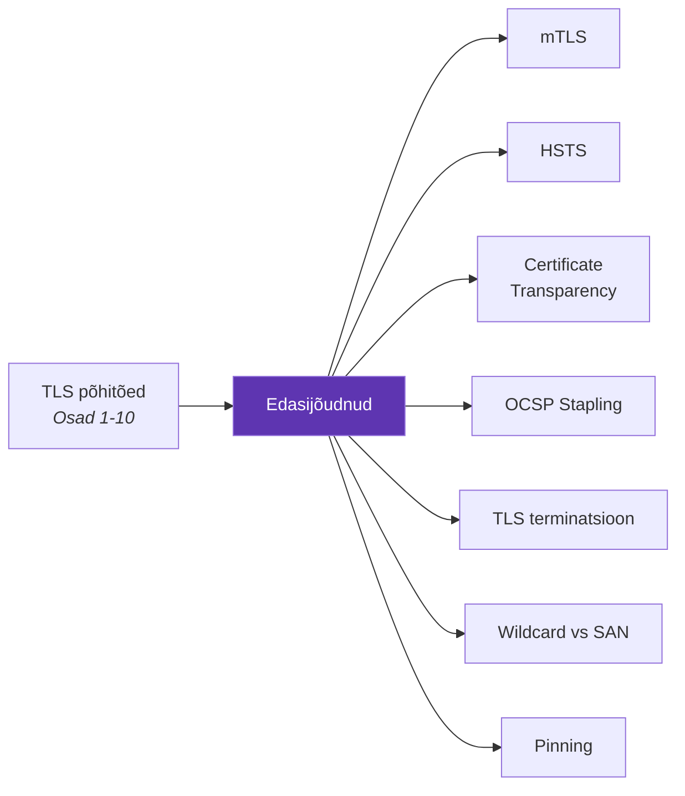
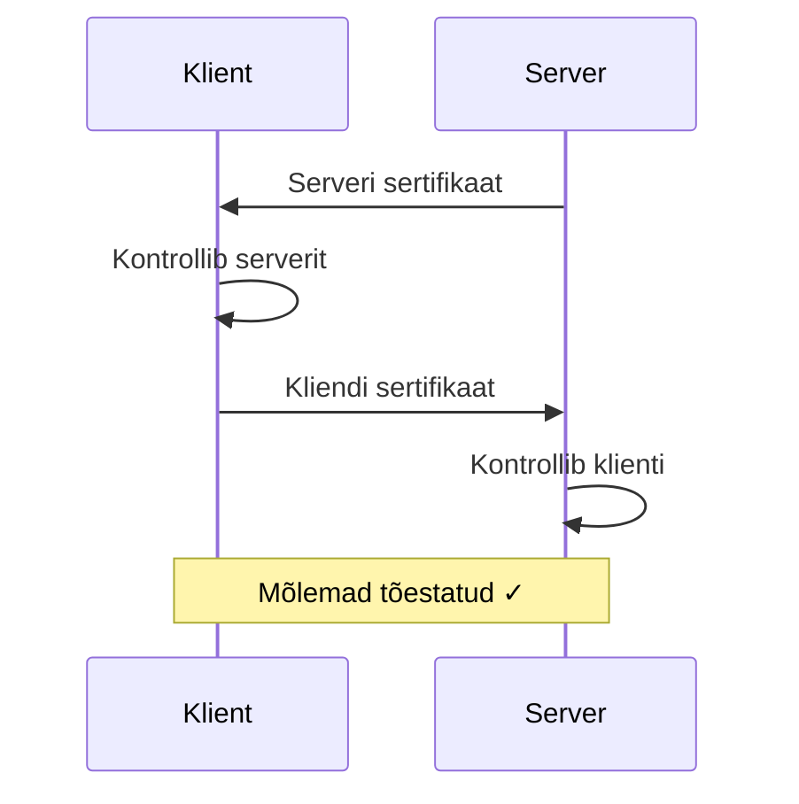

---
tags:
  - TLS
  - Turvalisus
---

# Edasijõudnud teemad

## Ülevaade

Eelmistes osades vaatasime TLS-i põhitõdesid: kuidas käepigistus töötab, mis on sertifikaadid, kuidas neid hallata. See kõik on vajalik, aga päris maailm on keerulisem. Siin vaatame teemasid, mis tulevad mängu, kui sinu süsteemid kasvavad ja turvanõuded tõusevad.



*Joonis 11.1. Edasijõudnud teemade ülevaade (Talvik, 2025). Loodud tehisintellekti abil.*

---

## Mutual TLS (mTLS)

Tavalises TLS-is autentib end ainult server. Brauser kontrollib serveri sertifikaati, aga server ei küsi kunagi brauserilt: "Aga kes sina oled?"

mTLS[^rfc8446] keerab selle ümber — ka klient peab ennast sertifikaadiga tõestama. See on nagu turvauks, kust saavad läbi ainult need, kellel on nii pääse kui ka isikut tõendav dokument.



*Joonis 11.2. mTLS vastastikune autentimine (Talvik, 2025). Loodud tehisintellekti abil.*

**Kasutuskohad:** microservice'ide vaheline suhtlus, zero-trust võrgud, kriitilised API-d (pangad, tervishoid). Eestis on ID-kaardiga autentimine sisuliselt mTLS — brauser saadab serverile oma sertifikaadi ja tõestab privaatvõtme olemasolu.

```nginx
# Nginx mTLS konfiguratsioon
ssl_client_certificate /etc/ssl/ca.crt;
ssl_verify_client on;
```

```bash
# curl koos kliendi sertifikaadiga
curl --cert klient.crt --key klient.key https://server/
```

---

## HTTP Strict Transport Security (HSTS)

Kujuta ette, et kasutaja trükib brauseri aadressiribale `minusait.ee`. Brauser proovib kõigepealt HTTP-d — tavateksti, mida igaüks saab lugeda. Alles siis suunatakse HTTPS-ile. See lühike hetk on haavatav: ründaja samas WiFi-võrgus saab selle tavateksti päringus kinni püüda ja suunata kasutaja enda serverisse.

HSTS[^hsts] lahendab selle. Server saadab päise, mis ütleb brauserile: "Ära ürita selle domeeniga kunagi HTTP-d. Alati ainult HTTPS."

```
Strict-Transport-Security: max-age=31536000; includeSubDomains
```

Pärast esimest külastust brauser enam HTTP-d ei proovigi — ta läheb otse HTTPS-ile. See kaitseb **downgrade rünnakute** eest.

**HSTS preload** läheb sammu kaugemale — sinu domeen lisatakse brauseritesse sisseehitatud nimekirja, nii et isegi esimene külastus on kaitstud. Brauser ei ürita kunagi HTTP-d: [hstspreload.org](https://hstspreload.org/)

---

## Certificate Transparency (CT)

Mis juhtub, kui CA väljastab sinu domeenile sertifikaadi ilma sinu teadmata? Ehk CA häkiti, ehk töötaja tegi vea, ehk valitsus sundis. Tulemuseks on kehtiv sertifikaat, mida ükski brauser kahtluse alla ei sea — aga see pole sinu oma.

CT[^ct] lahendab selle, logides iga väljastatud sertifikaadi avalikesse logidesse. Need logid on kõigile nähtavad ja kontrollitavad. Brauserid nõuavad CT logimist — sertifikaadiga tuleb kaasa SCT (Signed Certificate Timestamp), mis tõestab, et sertifikaat on logitud.

```bash
# Monitoori oma domeeni sertifikaate
curl "https://crt.sh/?q=minusait.ee&output=json" | jq '.[0:5]'
```

Kui näed sertifikaati, mida sina ei taotlenud — see on tõsine ohumärk ja vajab kohest uurimist.

---

## OCSP Stapling

Traditsiooniliselt küsib brauser iga TLS ühenduse ajal CA-lt: "Kas see sertifikaat on veel kehtiv?" See on OCSP (Online Certificate Status Protocol) päring. Probleem on kahekordne: see lisab latentsust (üks lisa-päring enne lehe laadimist) ja annab CA-le infot sinu surfamisharjumustest, sest CA näeb, milliseid saite sa külastad.

**OCSP stapling** lahendab mõlemad probleemid. Server küsib ise perioodiliselt CA-lt OCSP vastuse ja "klammerdab" selle TLS käepigistuse ajal sertifikaadi külge. Brauser saab värske tõendi, et sertifikaat kehtib, ilma et peaks ise CA-ga rääkima.

```nginx
ssl_stapling on;
ssl_stapling_verify on;
resolver 8.8.8.8;
```

---

## TLS terminatsioon

Suurtes keskkondades on rakenduste ees load balancerid, mis jagavad liiklust. Küsimus on: kus TLS ühendus lõpeb? Sellel on kolm vastust, igaühel omad plussid ja miinused.

| Variant | Kuidas töötab | Pluss | Miinus |
|---------|--------------|-------|--------|
| **Terminatsioon** | LB dekrüpteerib, edastab HTTP-d backendile | Lihtne, backend ei tegele TLS-iga | LB↔backend krüpteerimata |
| **Passthrough** | LB suunab krüpteeritud liikluse otse | Turvalisem | Backend peab TLS-i tegema |
| **Re-encryption** | LB termineerib, loob uue TLS backendiga | Parim mõlemast | Kõige keerulisem |

*Tabel 11.1. TLS terminatsiooni variandid*

Enamikes tootmiskeskkondades kasutatakse terminatsiooni või re-encryption'i. Passthrough on lihtsaim, aga ei võimalda load balanceril liiklust inspekteerida ega marsruutida HTTP sisu põhjal.

---

## Wildcard vs SAN sertifikaadid

Kui sul on mitu alamdomeeni — www, api, mail, admin — kas teha igaühele oma sertifikaat või kasutada ühte, mis katab kõik? Kaks valikut:

| Omadus | Wildcard (`*.minusait.ee`) | SAN |
|--------|---------------------------|-----|
| Katab | Kõik ühetasemelised alamdomeenid | Konkreetsed loetletud nimed |
| Ei kata | Mitmetasemelisi (`test.api.minusait.ee`) | Mitte-loetletud nimesid |
| Haldus | Mugavam, üks sertifikaat | Täpsem kontroll |
| Lekke risk | Suurem (katab kõiki alamdomeene) | Väiksem (ainult loetletud) |

*Tabel 11.2. Wildcard ja SAN sertifikaatide võrdlus*

Praktikas on SAN sertifikaadid turvalisemad, sest võtmelekke korral on kahjuala väiksem. Wildcard on mugavam, kui alamdomeene lisandub pidevalt ja sa ei taha iga kord sertifikaati uuendada.

---

## Sertifikaadi kinnitamine (pinning)

Pinning tähendab, et rakendus usaldab ainult konkreetset sertifikaati või avalikku võtit, mitte kõiki CA allkirjastatuid. See kaitseb olukorra eest, kus ründaja saab usaldatud CA-lt vale sertifikaadi — tavaliselt läheks see brauserist läbi, aga pinning peatab selle.

**Miinus:** sertifikaadi uuendamisel tuleb rakendust uuendada. Kui pin aegub ja rakendust pole uuendatud, lakkab rakendus töötamast. See risk on nii suur, et veebibrauserites on pinning'ust loobutud — selle asemel kasutatakse Certificate Transparency-t.[^ristic]

Mobiilirakendustes on pinning endiselt levinud, eriti pangarakendustes ja muudes kõrge turvatasemega äppides.

---

## Kokkuvõte

Need teemad pole igapäevased — enamiku veebilehtede jaoks piisab tavalisest TLS-ist koos Let's Encrypt sertifikaadiga. Aga kui sinu süsteemid kasvavad, turvanõuded tõusevad või vajad microservice'ide vahelist usaldust, tulevad need teemad mängu.

---

## Enesekontroll

??? question "1. Mis on mTLS ja millal seda kasutada?"
    Mutual TLS — mõlemad pooled (server JA klient) tõestavad oma identiteeti sertifikaadiga. Kasutatakse microservice'ide vahel, zero-trust võrkudes ja kriitiliste API-de puhul (pangad, tervishoid).

??? question "2. Mis on HSTS ja millise rünnaku eest see kaitseb?"
    HSTS (HTTP Strict Transport Security) ütleb brauserile, et ühendugu selle saidiga alati ainult HTTPS-iga. Kaitseb downgrade rünnakute eest, kus ründaja suunab kasutaja HTTP-le ja kuulab liiklust pealt.

??? question "3. Mis on Certificate Transparency ja miks see vajalik on?"
    CT on süsteem, kus iga väljastatud sertifikaat logitakse avalikesse logidesse. Võimaldab avastada volitamata väljastatud sertifikaate. Brauserid nõuavad CT logimist. Monitoorida saab crt.sh kaudu.

[^rfc8446]: Rescorla, E. (2018). *The Transport Layer Security (TLS) Protocol Version 1.3*. RFC 8446. https://datatracker.ietf.org/doc/html/rfc8446
[^ct]: Laurie, B. et al. (2013). *Certificate Transparency*. RFC 6962. https://datatracker.ietf.org/doc/html/rfc6962
[^hsts]: Hodges, J. et al. (2012). *HTTP Strict Transport Security (HSTS)*. RFC 6797. https://datatracker.ietf.org/doc/html/rfc6797
[^ristic]: Ristić, I. (2022). *Bulletproof TLS and PKI*. Feisty Duck. https://www.feistyduck.com/books/bulletproof-tls-and-pki/
