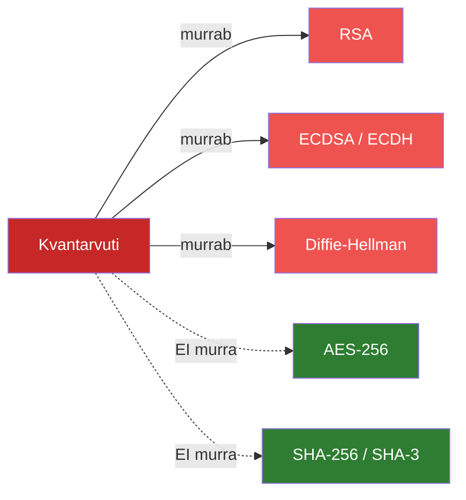
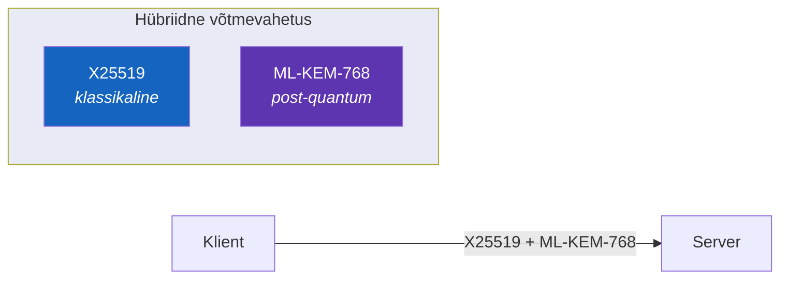

---
tags:
  - PQC
  - Turvalisus
---

# Kvantarvutid ja post-quantum krüptograafia

## Oht silmapiiril

Kõik, millest me seni rääkisime - RSA, elliptilised kõverad, Diffie-Hellman - põhineb matemaatilistel probleemidel, mida tavalised arvutid ei suuda kiiresti lahendada.

Kvantarvutid muudavad seda. 1994. aastal näitas Peter Shor,[^shor] et kvantarvuti suudaks faktoreerida suuri arve eksponentsiaalselt kiiremini. Piisavalt võimas kvantarvuti murrab RSA minutitega.

<figure markdown="span">
{ loading=lazy }
<figcaption>Joonis 12.1. Post-quantum krüptograafia ülevaade (Palo Alto Networks, 2024).</figcaption>
</figure>

## Mida murrab, mida mitte?

*Joonis 12.3. Kvantarvutite mõju krüptoalgoritmidele*

Sümmeetriline krüpteerimine (AES) ja räsifunktsioonid jäävad turvaliseks. Probleem on avaliku võtme krüptograafiaga - RSA, ECDSA, ECDH, DSA murduvad kõik.

## Millal see juhtub?

Keegi ei tea täpselt. Eksperdid hindavad **Q-päeva** (päev, mil kvantarvutid murravad praegust krüptograafiat) saabumist **2030-2040** vahele.

<figure markdown="span">
{ loading=lazy }
<figcaption>Joonis 12.2. Kvantarvutite arengu prognoos (LinkedIn, 2024).</figcaption>

!!! warning "Kogu nüüd, dekrüpteeri hiljem"
    Ründajad salvestavad **juba praegu** krüpteeritud liiklust. Kui kvantarvutid saabuvad, saavad nad vana liikluse lahti teha. Andmed, mis peavad jääma saladusse aastakümneteks (meditsiiniandmed, riigisaladused), on juba ohus.

---

## NIST PQC standardid

NIST korraldas aastaid kestnud konkursi ja valis 2024. aastal välja uued standardid:[^nist203]

| Algoritm | NIST nimi | Tüüp | Asendab | Põhineb |
|----------|-----------|------|---------|---------|
| **Kyber** | ML-KEM | Võtmevahetus | ECDH, DH | Võreprobleemid |
| **Dilithium** | ML-DSA | Allkiri | RSA, ECDSA | Võreprobleemid |
| **SPHINCS+** | SLH-DSA | Allkiri | RSA, ECDSA | Räsifunktsioonid |
| **FALCON** | FN-DSA | Allkiri | RSA, ECDSA | Võreprobleemid |

*Tabel 12.1. NIST PQC standardid (NIST, 2024)*

[^nist204]

## Suuruste võrdlus

PQC kompromiss on suurem andmemaht:

| Mida | Klassikaline | PQC | Kasv |
|------|-------------|-----|------|
| Avalik võti | RSA-2048: 256 B | ML-KEM-768: ~1200 B | ~5x |
| Allkiri | ECDSA: ~70 B | ML-DSA-65: ~3300 B | ~47x |

*Tabel 12.2. Klassikaliste ja PQC algoritmide suuruste võrdlus*

See tähendab kohandamist piiratud mäluga seadmetele ja aeglastele ühendustele.

---

## Hübriidne lähenemine

Üleminekuperioodil kasutatakse klassikalist ja PQC-d **koos**:

*Joonis 12.4. Hübriidne võtmevahetus TLS 1.3-s*

Kui üks algoritm osutub nõrgaks, kaitseb teine. See on konservatiivne, sest PQC algoritme pole nii kaua analüüsitud kui RSA-d.

## Hetkeseis tööstuses

PQC pole enam ainult akadeemiline teema — suuremad tegijad on juba liikuma hakanud.

| Kes | Mis toimub |
|-----|-----------|
| **Chrome, Firefox** | Hübriidne PQC vaikimisi lubatud |
| **Cloudflare, Google** | Serveripoolne tugi olemas |
| **TLS 1.3** | Toetab hübriidset võtmevahetust |
| **CA-d** | PQC sertifikaadid alles arendusfaasis |

*Tabel 12.3. PQC hetkeseis tööstuses*

See on märkamatu - kui brauser ja server toetavad, kasutatakse PQC-d automaatselt.

---

## Mida sina peaksid tegema?

See sõltub sellest, mida sa kaitsed ja kui pikalt andmed salajased peavad jääma.

| Olukord | Tegevus |
|---------|---------|
| Tavaline veebileht | Hoia tarkvara värske - PQC-tugi tuleb automaatselt |
| Pikaajalised tundlikud andmed | Inventeeri RSA/ECDSA kasutus, planeeri üleminek |
| Uued süsteemid | Kaalu hübriidset lähenemist juba praegu |

*Tabel 12.4. PQC tegevuskava*

Rohkem: [Open Quantum Safe projekt](https://openquantumsafe.org/)[^oqs] ja [NIST PQC standardid](https://csrc.nist.gov/projects/post-quantum-cryptography)

---

## Kokkuvõte

Kvantarvutid murravad RSA, ECDSA ja Diffie-Helmani, aga AES ja SHA jäävad turvaliseks. NIST standardiseeris uued algoritmid (ML-KEM, ML-DSA). Hübriidne lähenemine (klassikaline + PQC koos) on turvaline üleminekutee. Brauserid ja serverid toetavad PQC-d juba praegu.

---

## Enesekontroll

??? question "1. Miks on kvantarvutid oht praegusele krüptograafiale?"
    Shori algoritm võimaldab kvantarvutil faktoreerida suuri arve eksponentsiaalselt kiiremini. See murrab RSA, ECDSA ja Diffie-Hellmani. Sümmeetriline krüpteerimine (AES-256) jääb turvaliseks.

??? question "2. Mis on hübriidne PQC lähenemine ja miks seda kasutatakse?"
    Klassikaline algoritm (nt X25519) ja PQC algoritm (nt ML-KEM-768) kasutatakse koos. Kui üks osutub nõrgaks, kaitseb teine. See on konservatiivne lähenemine, sest PQC algoritmid on veel suhteliselt uued.

??? question "3. Mis on 'kogu nüüd, dekrüpteeri hiljem' rünnak?"
    Ründajad salvestavad täna krüpteeritud liiklust. Kui kvantarvutid saabuvad, saavad nad vana liikluse lahti teha. Seega on pikaajalised saladused (meditsiiniandmed, riigisaladused) juba praegu ohus.

[^shor]: Shor, P. W. (1994). *Algorithms for quantum computation: discrete logarithms and factoring*. Proceedings 35th Annual Symposium on Foundations of Computer Science, 124-134.
[^nist203]: National Institute of Standards and Technology. (2024). *FIPS 203: Module-Lattice-Based Key-Encapsulation Mechanism Standard (ML-KEM)*. https://csrc.nist.gov/pubs/fips/203/final
[^nist204]: National Institute of Standards and Technology. (2024). *FIPS 204: Module-Lattice-Based Digital Signature Standard (ML-DSA)*. https://csrc.nist.gov/pubs/fips/204/final
[^oqs]: Open Quantum Safe Project. https://openquantumsafe.org/
