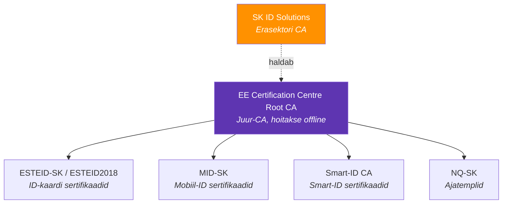
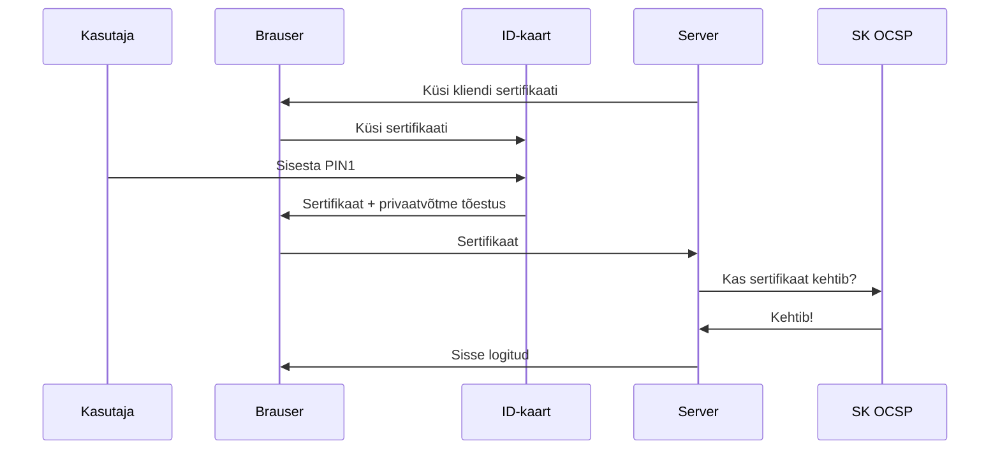
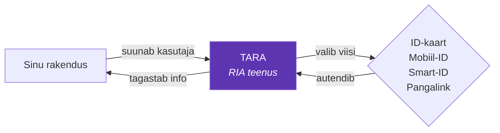

---
tags:
  - Eesti
  - PKI
---

# PKI Eestis: ID-kaart, Mobiil-ID ja SK

## Eesti digitaalne identiteet

Eesti on üks maailma kõige digitaalsemaid riike. E-valimised, e-residentsus, digiretseptid - kõik see töötab sertifikaatide ja digitaalallkirjade peal.[^idee] See on täpselt sama PKI süsteem, millest kogu see kursus räägib.

## Eesti PKI ülesehitus



*Joonis 13.1. Eesti PKI hierarhia ja SK ID Solutions*

**SK ID Solutions**[^sk] on Eesti PKI selgroog - erasektori sertifitseerimisasutus, mille juursertifikaadid on tunnustatud Eesti riigi ja enamiku Euroopa riikide süsteemides.

## ID-kaardi sertifikaadid

Iga Eesti ID-kaart sisaldab kahte sertifikaati:

| Sertifikaat | Kasutus | PIN |
|-------------|---------|-----|
| **Autentimine** | Isiku tõestamine (sisselogimine) | PIN1 |
| **Allkirjastamine** | Digitaalallkiri (DigiDoc) | PIN2 |

*Tabel 13.1. ID-kaardi sertifikaadid*

Privaatvõtmed on kaardi kiibis ja ei lahku sealt kunagi. Sertifikaadis on kirjas nimi, isikukood ja kehtivusaeg.

## Kuidas ID-kaardiga autentimine töötab?



*Joonis 13.2. ID-kaardiga autentimise protsess*

See on mTLS (mutual TLS) - mõlemad pooled tõestavad oma identiteeti.

## Autentimisvahendite võrdlus

| Vahend | Võti asub | Vajab | Turvalisus |
|--------|-----------|-------|------------|
| **ID-kaart** | Kaardi kiip | Kaardilugeja + PIN | Kõrgeim |
| **Mobiil-ID** | SIM-kaart | Eriline SIM + PIN | Kõrge |
| **Smart-ID** | Telefoni turvaelement | Äpp + PIN | Kõrge |

*Tabel 13.2. Autentimisvahendite võrdlus*

Kõik kolm on eIDAS[^eidas] määruse järgi kvalifitseeritud ja tunnustatud kogu Euroopa Liidus.

Rohkem: [id.ee](https://www.id.ee) ja [SK ID Solutions](https://www.sk.ee)

## DigiDoc allkirjastamine

DigiDoc4 klient loob .asice konteineri, mis sisaldab originaalfaile, digitaalallkirja, ajatemplit ja sertifikaatide ahelat. Kui keegi muudab faili pärast allkirjastamist, muutub allkiri kehtetuks.

Tarkvara on tasuta: [id.ee/artikkel/installi-id-tarkvara](https://www.id.ee/artikkel/installi-id-tarkvara/)

## TARA - autentimine-kui-teenus

Kui arendad tarkvara ja ei taha ise ID-kaardi, Mobiil-ID ja Smart-ID tuge implementeerida, kasuta TARA-t.[^tara]



*Joonis 13.3. TARA autentimisteenus*

TARA on OpenID Connect protokollil põhinev - standardne ja lihtne integreerida. Enamik Eesti avaliku sektori teenuseid kasutab seda.

Dokumentatsioon: [e-gov.github.io/TARA-Doku](https://e-gov.github.io/TARA-Doku/)

Erasektori alternatiivid: Dokobit, SK autentimisteenus.

## SK sertifikaatide usaldamine oma serveris

Kui sinu server peab usaldama Eesti ID-kaarte:

```bash
# Lae alla SK juursertifikaadid
wget https://www.sk.ee/upload/files/EE_Certification_Centre_Root_CA.pem.crt

# Linux truststoresse
sudo cp EE_Certification_Centre_Root_CA.pem.crt /usr/local/share/ca-certificates/
sudo update-ca-certificates
```

```bash
# Java truststoresse
keytool -importcert -alias sk-root \
    -file EE_Certification_Centre_Root_CA.pem.crt \
    -keystore truststore.jks -storepass changeit
```

Oluline on ka OCSP kontrolli implementeerimine - kui inimene kaotab ID-kaardi, tühistatakse sertifikaat ja sinu tarkvara peab seda teadma.

## Kokkuvõte

| Komponent | Mis see on | Haldab | Rohkem |
|-----------|-----------|--------|--------|
| ID-kaart | Krüptokiibiga kaart | PPA + SK | [id.ee](https://www.id.ee) |
| Mobiil-ID | SIM-põhine identiteet | Operaatorid + SK | [sk.ee](https://www.sk.ee) |
| Smart-ID | Telefonipõhine identiteet | SK | [smart-id.com](https://www.smart-id.com) |
| TARA | Autentimine-kui-teenus | RIA | [TARA docs](https://e-gov.github.io/TARA-Doku/) |
| DigiDoc | Allkirjastamise tarkvara | RIA | [id.ee](https://www.id.ee) |
| SK | Sertifitseerimisasutus | Eraettevõte | [sk.ee](https://www.sk.ee) |

*Tabel 13.3. Eesti PKI komponendid*

Eesti PKI pole mingi eriline maagia - see on sama matemaatika ja samad protokollid, mida kogu see kursus õpetab. Lihtsalt hästi implementeeritud ja laialt kasutusele võetud.

---

## Enesekontroll

??? question "1. Mis on SK ID Solutions ja millist rolli see Eesti PKI-s täidab?"
    SK on erasektori sertifitseerimisasutus, mis väljastab sertifikaate ID-kaartidele, Mobiil-ID-le ja Smart-ID-le. SK juursertifikaadid on Eesti riigi ja Euroopa riikide süsteemides tunnustatud.

??? question "2. Mis kaks sertifikaati on Eesti ID-kaardil?"
    Autentimissertifikaat (isiku tõestamiseks, PIN1) ja allkirjastamissertifikaat (digitaalallkirjadeks, PIN2). Mõlemad on seotud isikukoodiga. Privaatvõtmed on kaardi kiibis ja ei lahku sealt.

??? question "3. Mis on TARA ja miks seda kasutada?"
    TARA on RIA autentimine-kui-teenus. Toetab ID-kaarti, Mobiil-ID-d, Smart-ID-d ja pangalinke. Põhineb OpenID Connect protokollil. Lihtsam kui ise kõigi autentimisvahendite tuge implementeerida.

[^sk]: SK ID Solutions AS. *Sertifitseerimisteenused*. https://www.sk.ee
[^tara]: Riigi Infosüsteemi Amet. *TARA autentimisteenus*. https://e-gov.github.io/TARA-Doku/
[^idee]: ID.ee. *ID-kaardi tarkvara ja dokumentatsioon*. https://www.id.ee
[^eidas]: Euroopa Parlament ja Nõukogu. (2014). *Määrus (EL) nr 910/2014 (eIDAS)*. https://eur-lex.europa.eu/legal-content/ET/TXT/?uri=CELEX%3A32014R0910
