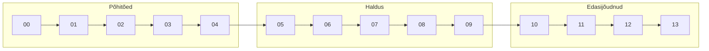

# Teooria

Kursuse teoreetiline osa koosneb 14 peatükist, mis viivad sind algajast edasijõudnuks.

---

## Põhitõed

| # | Teema | Kirjeldus |
|---|-------|-----------|
| [00](00_sissejuhatus.md) | Sissejuhatus | Miks see kõik oluline on |
| [01](01_ssl_tls_https.md) | SSL, TLS, HTTPS | Protokollide ajalugu ja erinevused |
| [02](02_pki.md) | PKI | Avaliku võtme infrastruktuur |
| [03](03_tls_kaepigistus.md) | TLS käepigistus | Kuidas turvaline ühendus luuakse |
| [04](04_sertifikaadid.md) | Sertifikaadid | Digitaalsed passid veebile |

---

## Haldus

| # | Teema | Kirjeldus |
|---|-------|-----------|
| [05](05_failivormingud.md) | Failivormingud | PEM, DER, P12, JKS |
| [06](06_sisemised_valised.md) | Sisemised vs välised | Millal millist CA-d kasutada |
| [07](07_keystore_truststore.md) | Keystore & Truststore | Java sertifikaadihaldus |
| [08](08_elutsykkel.md) | Elutsükkel | Sertifikaatide uuendamine ja rotatsioon |
| [09](09_automatiseerimine.md) | Automatiseerimine | Certbot, Vault, cert-manager |

---

## Edasijõudnud

| # | Teema | Kirjeldus |
|---|-------|-----------|
| [10](10_probleemid.md) | Probleemide lahendamine | TLS vigade diagnostika |
| [11](11_boonusteemad.md) | Boonusteemad | mTLS, HSTS, CT, pinning |
| [12](12_pqc.md) | Post-Quantum | Kvantarvutid ja PQC |
| [13](13_eesti_pki.md) | Eesti PKI | ID-kaart, Mobiil-ID, SK, TARA |

---

